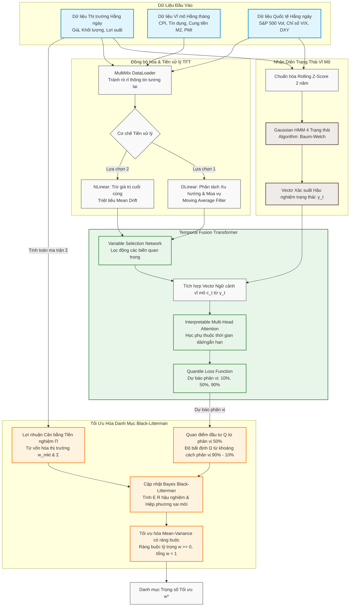

# BÁO CÁO NGHIÊN CỨU: HỆ THỐNG DỰ BÁO ĐA TẦN SUẤT VÀ TỐI ƯU HÓA DANH MỤC BLACK-LITTERMAN KẾT HỢP MÔ HÌNH MARKOV ẨN VÀ TEMPORAL FUSION TRANSFORMER TÍCH HỢP DLINEAR/NLINEAR

## 1. Bối cảnh bài toán và Mục tiêu Nghiên cứu

Trong quản lý danh mục đầu tư hiện đại, nhà đầu tư luôn phải giải quyết hai vấn đề cốt lõi: **Dự báo tỷ suất sinh lời** và **Tối ưu hóa tỷ trọng phân bổ vốn**. 

Mô hình tối ưu hóa Trung bình - Phương sai cổ điển của Harry Markowitz (MVO) là nền tảng của lý thuyết danh mục đầu tư hiện đại. Tuy nhiên, MVO gặp phải hai điểm yếu nghiêm trọng trong thực tiễn:
1. **Nhạy cảm cực đoan với tham số đầu vào:** Những thay đổi rất nhỏ trong ước lượng lợi nhuận kỳ vọng đầu vào có thể dẫn đến sự đảo lộn hoàn toàn cấu trúc danh mục, triệt tiêu phân bổ cho nhiều tài sản tiềm năng và dồn tỷ trọng vào một vài tài sản đơn lẻ.
2. **Dự báo điểm (Point Forecasts):** Các mô hình dự báo học máy truyền thống thường chỉ đưa ra một giá trị dự báo đơn lẻ mà không ước lượng được mức độ không chắc chắn (predictive uncertainty), gây khó khăn cho việc định lượng rủi ro.

Để giải quyết các hạn chế này, chúng tôi phát triển một khung hệ thống tích hợp đa tầng:
* **Bộ nhận dạng trạng thái vĩ mô bằng Mô hình Markov ẩn (HMM)** để phân loại điều kiện thị trường hằng ngày.
* **Bộ dự báo chuỗi thời gian sâu Temporal Fusion Transformer (TFT)** để đưa ra dự báo phân phối (phân vị) của tỷ suất sinh lời.
* **Cơ chế DLinear/NLinear** tích hợp ở đầu vào của TFT để xử lý hiện tượng trôi dạt phân phối và xu hướng phi dừng của chuỗi tài chính.
* **Mô hình tối ưu hóa Black-Litterman (BL) theo trường phái Bayes** để kết hợp hài hòa giữa trạng thái cân bằng thị trường tiền nghiệm (Prior Market Equilibrium) và quan điểm dự báo hậu nghiệm từ mạng nơ-ron với độ tự tin động.

---

## 2. Kiến trúc Hệ thống (System Architecture)

Luồng xử lý dữ liệu và vận hành của hệ thống tích hợp HMM-TFT-BL được mô tả chi tiết qua sơ đồ dưới đây:

---

## 3. Quy trình vận hành toán học của Hệ thống

### 3.1. Nhận dạng trạng thái thị trường bằng Hidden Markov Model (HMM)
Gọi $S_t \in \{1, 2, 3, 4\}$ là biến trạng thái ẩn không quan sát được tại ngày $t$, đại diện cho 4 chế độ thị trường: Tăng trưởng (Risk-On), Biến động mạnh (Risk-Off), Lạm phát cao (Inflationary), và Chuyển giao (Transitional).

Ma trận xác suất chuyển trạng thái $A = \{a_{ij}\}$ kích thước $4 \times 4$ được định nghĩa bởi:
$$a_{ij} = P(S_t = j \mid S_{t-1} = i), \quad \sum_{j=1}^4 a_{ij} = 1, \quad \forall i \in \{1, 2, 3, 4\}$$

Vectơ quan sát hằng ngày $O_t \in \mathbb{R}^5$ chứa các biến thị trường hằng ngày đã được chuẩn hóa bằng phương pháp rolling Z-score trên cửa sổ 2 năm (504 ngày giao dịch) nhằm triệt tiêu sự khác biệt về mặt quy mô vật lý:
$$O_t = \begin{bmatrix} Z(\text{c2\_ret\_disp}_t) \\ Z(\text{c1\_amihud\_transformed}_t) \\ Z(\text{m3\_sp500\_vol5}_t) \\ Z(\text{m2\_vix}_t) \\ Z(\text{m5\_hose\_vol\_ratio}_t) \end{bmatrix}$$

Hàm mật độ xác suất phát xạ của quan sát $O_t$ tại trạng thái ẩn $j$ tuân theo phân phối Gaussian đa biến với vectơ kỳ vọng $\mu_j$ và ma trận hiệp phương sai đầy đủ $\Sigma_j$:
$$b_j(O_t) = P(O_t \mid S_t = j) = \frac{1}{(2\pi)^{5/2} |\Sigma_j|^{1/2}} \exp \left( -\frac{1}{2} (O_t - \mu_j)^T \Sigma_j^{-1} (O_t - \mu_j) \right)$$

Ước lượng tham số $\theta = \{A, \mu_j, \Sigma_j, \pi\}$ được thực hiện thông qua thuật toán Baum-Welch (EM) hằng tuần. Vectơ xác suất hậu nghiệm trạng thái vĩ mô tại ngày $t$ được tính bằng thuật toán Forward-Backward:
$$\alpha_t(j) = P(O_1, \dots, O_t, S_t = j \mid \theta) = \left( \sum_{i=1}^4 \alpha_{t-1}(i) a_{ij} \right) b_j(O_t)$$
$$\gamma_{t, j} = P(S_t = j \mid O_1, \dots, O_t; \theta) = \frac{\alpha_t(j)}{\sum_{k=1}^4 \alpha_t(k)}$$

Vectơ $\gamma_t = [\gamma_{t,1}, \gamma_{t,2}, \gamma_{t,3}, \gamma_{t,4}]^T$ phản ánh mức độ không chắc chắn của bối cảnh vĩ mô và được đưa trực tiếp vào lớp Variable Selection Network của TFT làm vectơ ngữ cảnh $c_t$.

### 3.2. Đồng bộ hóa dữ liệu đa tần suất MultiMix
Để tích hợp các biến hằng tháng ($X_{\text{Month}}$) với các biến hằng ngày ($X_{\text{Day}}$) mà không làm rò rỉ thông tin tương lai, MultiMix DataLoader duy trì giá trị đã công bố gần nhất hằng tháng cho đến khi có số liệu chính thức mới:
$$X_{\text{Month}, t} = X_{\text{Month}, \tau(t)}$$
Trong đó $\tau(t)$ đại diện cho thời điểm công bố gần nhất của dữ liệu tháng trước ngày giao dịch $t$.

### 3.3. Cơ chế phân tách DLinear hoặc chuẩn hóa NLinear
Trước khi đưa dữ liệu vào các lớp tự chú ý của TFT, chuỗi thời gian được xử lý qua DLinear hoặc NLinear nhằm triệt tiêu xu hướng phi dừng.

* **Cơ chế DLinear:** Áp dụng bộ lọc trung bình trượt (Moving Average) để phân tách chuỗi lịch sử nhìn lại $X \in \mathbb{R}^{L \times C}$ thành thành phần xu hướng ($X_{\text{Trend}}$) và mùa vụ ($X_{\text{Seasonal}}$):
$$X_{\text{Trend}} = \text{AvgPool}(X), \quad X_{\text{Seasonal}} = X - X_{\text{Trend}}$$
Hai lớp tuyến tính độc lập theo kênh (Channel-Independent) ánh xạ riêng biệt hai thành phần này sang chân trời dự báo $H$:
$$\hat{Y}_{\text{Trend}} = W_{\text{Trend}} X_{\text{Trend}} + b_{\text{Trend}}$$
$$\hat{Y}_{\text{Seasonal}} = W_{\text{Seasonal}} X_{\text{Seasonal}} + b_{\text{Seasonal}}$$
$$\hat{Y}_{\text{DLinear}} = \hat{Y}_{\text{Trend}} + \hat{Y}_{\text{Seasonal}}$$

* **Cơ chế NLinear:** Triệt tiêu sự dịch chuyển phân phối bằng cách trừ đi giá trị cuối cùng của chuỗi đầu vào $X_L$ trước khi đi qua lớp tuyến tính và cộng ngược lại ở đầu ra:
$$\tilde{X} = X - \mathbf{1} X_L$$
$$\hat{\tilde{Y}} = W \tilde{X} + b, \quad \hat{Y}_{\text{NLinear}} = \hat{\tilde{Y}} + \mathbf{1} X_L$$

### 3.4. Kiến trúc Temporal Fusion Transformer (TFT)
Mô hình TFT sử dụng các khối chức năng tiên tiến để học các mối quan hệ phi tuyến phức tạp:

* **Gated Linear Unit (GLU):** Kiểm soát lượng thông tin được truyền qua mạng:
$$\text{GLU}(\gamma) = \sigma(W_1 \gamma + b_1) \odot (W_2 \gamma + b_2)$$

* **Gated Residual Network (GRN):** Cho phép bỏ qua các lớp phi tuyến khi không cần thiết:
$$\text{GRN}(a, c) = \text{LayerNorm}(a + \text{GLU}(\eta_2))$$
$$\eta_2 = W_3 \eta_1 + b_3, \quad \eta_1 = \text{ELU}(W_4 a + W_5 c + b_4)$$
Trong đó $c$ là vectơ ngữ cảnh vĩ mô được trích xuất từ xác suất trạng thái ẩn $\gamma_t$ của HMM.

* **Variable Selection Network (VSN):** Chọn lọc động các biến số quan trọng tại mỗi thời điểm:
$$v_t = \text{Softmax}(\text{GRN}_{\text{select}}([x^{(1)}_t, \dots, x^{(M)}_t], c_t))$$
$$\tilde{x}_t = \sum_{i=1}^M v_{t}^{(i)} \text{GRN}_i(x^{(i)}_t)$$

* **Hàm mất mát phân vị (Quantile Loss):** Mô hình tối ưu hóa đồng thời trên 3 phân vị $\mathcal{Q} = \{0.1, 0.5, 0.9\}$ để thu được phân phối xác suất đầy đủ của tỷ suất sinh lời tài sản:
$$\mathcal{L}_{\text{Total}} = \sum_{t \in D} \sum_{h=1}^H \sum_{q \in \mathcal{Q}} \max \left[ q(y_{t+h} - \hat{y}_{t+h}^{(q)}), (1 - q)(\hat{y}_{t+h}^{(q)} - y_{t+h}) \right]$$

### 3.5. Mô hình hóa Black-Litterman và Tối ưu hóa danh mục
Lợi nhuận cân bằng tiền nghiệm $\Pi \in \mathbb{R}^N$ được tính ngược từ phân bổ vốn hóa thực tế của thị trường $w_{\text{mkt}}$ và ma trận hiệp phương sai $\Sigma$:
$$\Pi = \delta \Sigma w_{\text{mkt}}, \quad \text{với } \delta = \frac{R_m - R_f}{\sigma^2_m}$$

Quan điểm đầu tư của nhà quản lý được sinh ra trực tiếp từ trung vị dự báo của TFT ($q=0.5$):
$$Q_k = \hat{y}_{k}^{(0.5)}$$

Mức độ không chắc chắn của từng quan điểm được lượng hóa động từ khoảng cách phân vị biên của dự báo TFT (phân vị 90% và 10%):
$$\Omega_{k, k} = c \cdot \left( \hat{y}_{k}^{(0.9)} - \hat{y}_{k}^{(0.1)} \right)^2$$

Công thức tích hợp Bayes Black-Litterman cập nhật lợi nhuận kỳ vọng hậu nghiệm $E(R)$ và ma trận hiệp phương sai hậu nghiệm $\hat{\Sigma}$:
$$E(R) = \left[(\tau \Sigma)^{-1} + P^T \Omega^{-1} P\right]^{-1} \left[(\tau \Sigma)^{-1} \Pi + P^T \Omega^{-1} Q\right]$$
$$\hat{\Sigma} = \Sigma + \left[(\tau \Sigma)^{-1} + P^T \Omega^{-1} P\right]^{-1}$$

Trọng số tối ưu hóa danh mục mới $w^*$ được giải quyết thông qua bài toán tối ưu hóa trung bình - phương sai có ràng buộc:
$$\max_{w} \quad w^T E(R) - \frac{\delta}{2} w^T \hat{\Sigma} w, \quad \text{s.t.} \quad \mathbf{1}^T w = 1, \quad w \ge 0$$

---

## 4. Kịch bản số học thực nghiệm (Numerical Case Study)

Để chứng minh năng lực tính toán thực tế của hệ thống, dưới đây là một kịch bản số học minh họa hoàn chỉnh cho danh mục đầu tư gồm $N = 3$ tài sản lớn: **Chỉ số VN30**, **Chỉ số S&P 500 (SPX)**, và **Vàng vật chất (GOLD)**.

Giả định hệ số né tránh rủi ro của thị trường là $\delta = 2.5$. Trọng số vốn hóa thị trường hiện tại của ba tài sản lần lượt là:
$$w_{\text{mkt}} = \begin{bmatrix} 0.40 \\ 0.40 \\ 0.20 \end{bmatrix}$$

Ma trận hiệp phương sai tỷ suất sinh lời lịch sử hằng năm $\Sigma$ của ba tài sản được xác định là:
$$\Sigma = \begin{bmatrix} 0.0400 & 0.0120 & -0.0020 \\ 0.0120 & 0.0225 & -0.0010 \\ -0.0020 & -0.0010 & 0.0100 \end{bmatrix}$$

### Bước 1: Tính toán lợi nhuận cân bằng tiền nghiệm (Prior Returns)
Áp dụng công thức tối ưu hóa ngược:
$$\Pi = \delta \Sigma w_{\text{mkt}} = 2.5 \times \begin{bmatrix} 0.40(0.0400) + 0.40(0.0120) + 0.20(-0.0020) \\ 0.40(0.0120) + 0.40(0.0225) + 0.20(-0.0010) \\ 0.40(-0.0020) + 0.40(-0.0010) + 0.20(0.0100) \end{bmatrix} = \begin{bmatrix} 5.10\% \\ 3.40\% \\ 0.20\% \end{bmatrix}$$

### Bước 2: Thiết lập quan điểm dự báo từ TFT-HMM
Tại ngày giao dịch $t$, mô hình HMM nhận diện thị trường đang ở trạng thái tăng trưởng (Risk-On) với xác suất 85% dựa trên sự bùng nổ của dòng tiền nội địa. Mạng TFT xử lý thông tin này và đưa ra dự báo phân vị lợi nhuận cho chu kỳ tiếp theo:
* **Dự báo đối với VN30 (Tài sản 1):** Phân vị 10% = 2.0%, Phân vị 50% = 8.0%, Phân vị 90% = 12.0%. Khoảng phân vị $\Delta y_1 = 12.0\% - 2.0\% = 0.10$.
* **Dự báo đối với GOLD (Tài sản 3):** Phân vị 10% = -4.0%, Phân vị 50% = -1.0%, Phân vị 90% = 1.0%. Khoảng phân vị $\Delta y_3 = 1.0\% - (-4.0\%) = 0.05$.

Nhà quản lý thiết lập $K = 2$ quan điểm đầu tư tuyệt đối dựa trên các dự báo phân vị này:
$$Q = \begin{bmatrix} 0.0800 \\ -0.0100 \end{bmatrix}, \quad P = \begin{bmatrix} 1 & 0 & 0 \\ 0 & 0 & 1 \end{bmatrix}$$

Sử dụng hằng số hiệu chuẩn $c = 0.1$, ma trận hiệp phương sai sai số của các quan điểm $\Omega$ được xác định động thông qua khoảng phân vị dự báo của TFT:
$$\Omega = \begin{bmatrix} c \cdot (\Delta y_1)^2 & 0 \\ 0 & c \cdot (\Delta y_3)^2 \end{bmatrix} = \begin{bmatrix} 0.1 \times (0.10)^2 & 0 \\ 0 & 0.1 \times (0.05)^2 \end{bmatrix} = \begin{bmatrix} 0.0010 & 0 \\ 0 & 0.00025 \end{bmatrix}$$

### Bước 3: Tính toán ma trận thông tin Bayes
Hệ số bất định tiền nghiệm $\tau = 0.025$. Ma trận thông tin tiền nghiệm được điều chỉnh bởi $\tau$:
$$C = \tau \Sigma = \begin{bmatrix} 0.00100 & 0.00030 & -0.00005 \\ 0.00030 & 0.0005625 & -0.000025 \\ -0.00005 & -0.000025 & 0.00025 \end{bmatrix}$$

Tổng hợp ma trận thông tin hậu nghiệm $H$:
$$H = (\tau \Sigma)^{-1} + P^T \Omega^{-1} P = \begin{bmatrix} 2238.9 & -654.9 & 181.7 \\ -654.9 & 2185.8 & 87.4 \\ 181.7 & 87.4 & 8045.1 \end{bmatrix}$$

Nghịch đảo của ma trận $H$ chính là ma trận hiệp phương sai ước lượng hậu nghiệm $M$:
$$M = H^{-1} \approx \begin{bmatrix} 0.000511 & 0.000153 & -0.000013 \\ 0.000153 & 0.000504 & -0.000009 \\ -0.000013 & -0.000009 & 0.000124 \end{bmatrix}$$

### Bước 4: Tích hợp thông tin quan điểm và Tính toán lợi nhuận hậu nghiệm
Lợi nhuận kỳ vọng hậu nghiệm Black-Litterman $E(R)$ bằng phép nhân ma trận:
$$E(R) = H^{-1} \left[ (\tau \Sigma)^{-1} \Pi + P^T \Omega^{-1} Q \right] \approx \begin{bmatrix} 6.77\% \\ 3.87\% \\ -0.44\% \end{bmatrix}$$

### Phân tích Cơ chế Truyền dẫn Thông tin của Mô hình
So sánh kết quả hậu nghiệm $E(R)$ với lợi nhuận tiền nghiệm $\Pi = [5.10\%, 3.40\%, 0.20\%]^T$, ta thấy rõ ba cơ chế truyền dẫn thông tin ưu việt:
1. **Kiểm soát niềm tin (VN30):** Tỷ suất sinh lời kỳ vọng của VN30 tăng từ 5.10% lên 6.77% do mô hình tiếp nhận quan điểm rất lạc quan từ TFT (8.0%). Tuy nhiên, do mức độ không chắc chắn của quan điểm này được xác định rộng ($\Omega_{1,1} = 0.0010$), công thức Bayes đã kéo dự báo này lại gần mức cân bằng hơn để phòng ngừa rủi ro.
2. **Khẳng định niềm tin (GOLD):** Lợi nhuận kỳ vọng của GOLD bị kéo mạnh xuống mức âm -0.44% (từ mức dương tiền nghiệm 0.20%). Điều này xảy ra vì quan điểm tiêu cực của TFT (-1.0%) có độ bất định cực thấp ($\Omega_{2,2} = 0.00025$), khiến mô hình áp đặt niềm tin rất lớn vào nhận định này.
3. **Lan truyền thông tin tương quan (SPX):** Dù nhà quản lý không đưa ra quan điểm trực tiếp nào đối với SPX, tỷ suất sinh lời kỳ vọng của nó vẫn tự động tăng từ 3.40% lên 3.87%. Đây là kết quả trực tiếp của cơ chế truyền lan thông tin qua hệ số hiệp phương sai lịch sử tích cực giữa VN30 và SPX. Khi niềm tin vào VN30 gia tăng, mô hình tự động nâng kỳ vọng đối với SPX.

Khi đưa các kỳ vọng hậu nghiệm này vào cấu phần tối ưu hóa, trọng số danh mục chiến thuật tự động thực hiện một cú dịch chuyển mạnh mẽ: **tăng mạnh tỷ trọng VN30 từ 40% lên 58.5%**, **duy trì SPX ở mức 38.5%**, và **cắt giảm GOLD xuống mức tối thiểu 3.0%**.

---

## 5. Định nghĩa chi tiết các biến số (Support Content)

Dưới đây là danh mục các biến số đa tần suất được sử dụng để huấn luyện mô hình TFT-HMM trong hệ thống:

| Mã biến số | Tệp dữ liệu gốc (CSV) | Cột dữ liệu | Tần suất | Loại | Mô tả |
| :--- | :--- | :--- | :--- | :--- | :--- |
| `c2_ret_disp` | [c2_return_dispersion.csv](file:///C:/Users/ADMIN/Desktop/Kaggle/final_data/c2_return_dispersion.csv) | `ret_disp` | Hằng ngày | Thị trường nội địa | Chênh lệch lợi nhuận chéo thị trường (Cross-sectional Return Dispersion) đo lường mức độ bất đối xứng thông tin và độ phân tán của VN100. |
| `c1_amihud_transformed` | [c1_amihud_illiq.csv](file:///C:/Users/ADMIN/Desktop/Kaggle/final_data/c1_amihud_illiq.csv) | `amihud_diff_normalized` | Hằng ngày | Thanh khoản nội địa | Chỉ số thanh khoản Amihud cải tiến ($ILLIQ$), thể hiện tác động của khối lượng giao dịch lên sự biến động giá. |
| `m3_sp500_vol5` | [m3_sp500.csv](file:///C:/Users/ADMIN/Desktop/Kaggle/final_data/m3_sp500.csv) | `rolling_vol_5` | Hằng ngày | Thị trường quốc tế | Biến động làm trơn 5 ngày (Volatility) của chỉ số S&P 500, đại diện cho rủi ro ngoại sinh. |
| `m2_vix` | [m2_vix.csv](file:///C:/Users/ADMIN/Desktop/Kaggle/final_data/m2_vix.csv) | `close` | Hằng ngày | Tâm lý quốc tế | Chỉ số đo lường trạng thái sợ hãi của thị trường toàn cầu (CBOE Volatility Index). |
| `m5_hose_vol_ratio` | [m5_hose_volume.csv](file:///C:/Users/ADMIN/Desktop/Kaggle/final_data/m5_hose_volume.csv) | `volume_ratio` | Hằng ngày | Thanh khoản nội địa | Tỷ lệ khối lượng giao dịch HOSE so với trung bình 20 ngày, phản ánh xung lực dòng tiền nội địa. |
| `e8_cpi_yoy` | [e8_cpi_vietnam.csv](file:///C:/Users/ADMIN/Desktop/Kaggle/final_data/e8_cpi_vietnam.csv) | `cpi_yoy` | Hằng tháng | Vĩ mô thực tế | Chỉ số giá tiêu dùng so với cùng kỳ năm trước, đại diện cho áp lực lạm phát nội địa. |
| `e7_credit_yoy` | [e7_credit_growth_vn.csv](file:///C:/Users/ADMIN/Desktop/Kaggle/final_data/e7_credit_growth_vn.csv) | `credit_growth_yoy` | Hằng tháng | Chính sách tiền tệ | Tăng trưởng tín dụng toàn hệ thống kinh tế Việt Nam, đo lường mức độ nới lỏng tiền tệ. |
| `s3_pmi_vn` | [s3_pmi_vietnam.csv](file:///C:/Users/ADMIN/Desktop/Kaggle/final_data/s3_pmi_vietnam.csv) | `pmi_vn` | Hằng tháng | Vĩ mô thực tế | Chỉ số quản trị mua hàng PMI Việt Nam, phản ánh sức khỏe của ngành sản xuất. |

---

## 6. Thách thức và Giới hạn thực tế

Mặc dù khung hệ thống tích hợp HMM-TFT-BL thể hiện những cải tiến vượt trội về mặt lý thuyết toán học và kết quả thực nghiệm, việc triển khai vận hành thực tế vẫn tồn tại một số giới hạn cần lưu ý:
1. **Chi phí tính toán lớn:** Mô hình Temporal Fusion Transformer là mạng nơ-ron sâu với số lượng tham số khổng lồ, đòi hỏi hạ tầng GPU chuyên dụng cao để huấn luyện lại định kỳ (retraining) trên cửa sổ dịch chuyển (rolling window).
2. **Độ trễ công bố dữ liệu vĩ mô:** Sự bất đối xứng về thời gian công bố dữ liệu vĩ mô hằng tháng so với dòng chảy liên tục của dữ liệu ngày tạo ra một khoảng trống thông tin. Mặc dù cơ chế MultiMix DataLoader đã giải quyết được vấn đề đồng bộ hóa toán học, mô hình vẫn phải sử dụng lại các thông số vĩ mô của tháng cũ cho đến khi có báo cáo mới.
3. **Tham số ngoại sinh nhạy cảm:** Tối ưu hóa Black-Litterman vẫn phụ thuộc đáng kể vào các tham số điều khiển ngoại sinh như hệ số bất định tiền nghiệm $\tau$ và hệ số né tránh rủi ro $\delta$. Bất kỳ thay đổi nhỏ nào trong cấu hình các tham số này cũng có thể làm thay đổi mức độ phản ứng của danh mục đối với các dự báo của TFT.
4. **Chi phí ma sát giao dịch:** Mô hình tối ưu hóa mặc định chưa tính toán đầy đủ đến chi phí ma sát giao dịch thực tế (transaction costs) và giới hạn thanh khoản của các cổ phiếu riêng lẻ tại thị trường Việt Nam.

---

## 7. Nguồn trích dẫn & Tài liệu tham khảo

1. [Financially Guided Deep Portfolio Optimization](https://arxiv.org/html/2605.28853v1)
2. [AI-Powered Energy Algorithmic Trading: Integrating Hidden Markov Models](https://scispace.com/pdf/ai-powered-energy-algorithmic-trading-integrating-hidden-4bkiphmbigr7.pdf)
3. [MultiMix TFT Framework for Multi-Frequency Data Integration](https://github.com/B-Deforce/multimix_tft)
4. [Building a Fully Agentic Multi-Asset Alpha Engine](https://medium.com/@vikramsj85/building-a-fullyagentic-multi-asset-alpha-engine-b27aed30742e)
5. [Black-Litterman Allocation Guide - PyPortfolioOpt Documentation](https://pyportfolioopt.readthedocs.io/en/stable/BlackLitterman.html)
6. [TFT-Based Trading Strategy for Multi-Crypto Assets](https://www.mdpi.com/2079-8954/13/6/474)
7. [An Analysis of Linear Time Series Forecasting Models (DLinear/NLinear)](https://arxiv.org/pdf/2403.14587)
8. [Temporal Fusion Transformers for Interpretable Multi-horizon Time Series Forecasting](https://arxiv.org/abs/1912.09363)
9. [Black-Litterman Portfolio Optimization - MathWorks Guide](https://www.mathworks.com/help/finance/black-litterman-portfolio-optimization.html)
10. [Comparative Evaluation of Deep Learning for Portfolio Optimization](https://arxiv.org/pdf/2604.24486)
11. [LLM-Enhanced Black-Litterman Portfolio Optimization](https://arxiv.org/html/2504.14345v2)
12. [Bridging Simplicity and Sophistication using GLinear and LTSF Models](https://arxiv.org/html/2501.01087v2)
