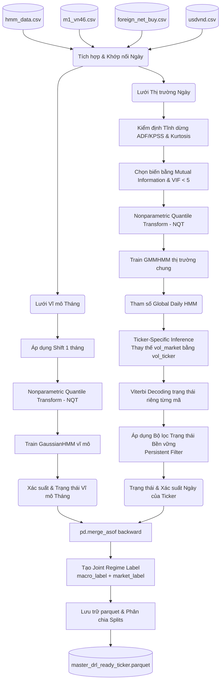

# BÁO CÁO PHÂN TÍCH SO SÁNH HAI PIPELINE HMM ĐA TẦN SỐ PHÂN CẤP CHO TỪNG MÃ CỔ PHIẾU
*(Hierarchical Ticker-Specific Dual-Frequency HMM)*

Báo cáo này cung cấp cái nhìn toàn diện, phân tích chi tiết và đối chiếu sự khác biệt giữa hai phiên bản notebook:
1. **Phiên bản cũ (Old V):** [hmm_pipeline_dual_frequency_ticker_old_v.ipynb](file:///C:/Users/ADMIN/Desktop/Kaggle/notebooks/hmm_pipeline_dual_frequency_ticker_old_v.ipynb)
2. **Phiên bản hiện tại (Current V):** [hmm_pipeline_dual_frequency_ticker.ipynb](file:///C:/Users/ADMIN/Desktop/Kaggle/notebooks/hmm_pipeline_dual_frequency_ticker.ipynb)

---

## 1. KIẾN THỨC NỀN TẢNG (KNOWLEDGE)

Mục tiêu cốt lõi của hai notebook này là phân tách và nhận diện các **trạng thái ẩn của thị trường tài chính (Market Regimes)**. Trong tài chính, các trạng thái này thường đại diện cho các pha như: *Bull Market* (Thị trường tăng giá, biến động thấp), *Bear Market/Crisis* (Thị trường giảm giá, biến động cao), *Sideways/Tranquil* (Thị trường đi ngang, ảm đạm).

Mô hình được xây dựng dựa trên các lý thuyết tài chính và toán học hiện đại:
*   **Mô hình Markov Ẩn (Hidden Markov Model - HMM):** Giả định rằng thị trường luôn vận hành trong một số trạng thái ẩn không thể quan sát trực tiếp. Chúng ta chỉ có thể quan sát các biến số kinh tế và thị trường (như biến động, lợi suất, thanh khoản, v.v.). Sự dịch chuyển giữa các trạng thái ẩn tuân theo một ma trận xác suất chuyển trạng thái (Transition Matrix).
*   **Mô hình Gauss hỗn hợp HMM (GMMHMM):** Mở rộng của Gaussian HMM, sử dụng phân phối hỗn hợp Gauss (Gaussian Mixture Models) cho phân phối phát xạ (emission distribution) để mô tả chính xác hơn các thuộc tính phi tuyến và đuôi dày (fat-tails) của chuỗi thời gian tài chính.
*   **Cấu trúc Phân cấp Đa Tần số (Hierarchical Dual-Frequency):**
    1.  *Tần số thấp (Monthly Macro HMM):* Nhận diện xu hướng vĩ mô dài hạn (Tăng trưởng sản xuất mở rộng hay Trì trệ).
    2.  *Tần số cao (Daily Market HMM):* Nhận diện biến động ngắn hạn của thị trường.
*   **Suy luận riêng cho từng mã (Ticker-Specific Inference từ Global HMM):** Huấn luyện các tham số phân phối chung (Global HMM) trên chỉ số đại diện thị trường (VN-Index Proxy) để nắm bắt quy luật chung, sau đó sử dụng các tham số này để giải mã chuỗi trạng thái ẩn riêng cho từng mã cổ phiếu (bằng cách thay thế biến động thị trường bằng biến động riêng của mã cổ phiếu đó).

---

## 2. LUỒNG DỮ LIỆU (DATAFLOW)

### 2.1. Dữ liệu đầu vào lấy từ đâu? (Data Retrieval)
Quy trình thu thập dữ liệu từ các tệp tin CSV đã qua xử lý trước đó:
*   `../output/hmm_data.csv`: Chứa các biến số thị trường và vĩ mô cơ sở ngày (`cpi_mom`, `credit_growth_mom`, `pmi_vn`, `amihud_diff_normalized`, `ret_disp`, `rolling_vol_5`, `volume_ratio`).
*   `../data/processed/m1_vn46.csv`: Cơ sở dữ liệu của 46 mã cổ phiếu thuộc nhóm VN46, cung cấp các thuộc tính giá (`open`, `high`, `low`, `close`), khối lượng (`volume`), lợi suất (`log_return`), biến động (`rolling_vol_20d`) và lợi suất lịch sử (`return_5d`, `return_20d`).
*   `../data/processed/m4_foreign_net_buy_sell.csv`: Tỷ lệ mua/bán ròng của khối ngoại (`fnb_ratio`).
*   `../data/processed/e1_usdvnd.csv`: Lợi suất log của tỷ giá USD/VND (`fx_log_ret`).

### 2.2. Biến đổi dữ liệu ra sao? (Data Transformation)
Dữ liệu đi qua các bước tiền xử lý chặt chẽ được tóm tắt trong bảng so sánh dưới đây:

| Bước xử lý | Phiên bản cũ (Old V) | Phiên bản hiện tại (Current V) | Ý nghĩa / Tác dụng |
| :--- | :--- | :--- | :--- |
| **Độ trễ Vĩ mô (Macro Shift)** | Không dịch chuyển (Dùng trực tiếp vĩ mô tháng $M$ cho ngày của tháng $M$). | **Dịch chuyển 1 tháng** (`shift(1)`) cho các đặc trưng vĩ mô (`cpi_mom`, `credit_growth_mom`, `pmi_vn`). | **Loại bỏ rò rỉ thông tin tương lai (Look-ahead Bias).** Số liệu vĩ mô tháng $M$ chỉ được công bố ở cuối tháng $M$ hoặc đầu tháng $M+1$, không thể biết trước để giao dịch trong tháng $M$. |
| **Chuẩn hóa Đặc trưng (Normalization)** | **Rolling Z-score** (Window=252 ngày) kết hợp Expanding Z-score cho các dòng đầu, clip về $[-3.0, 3.0]$. | **Nonparametric Quantile Transform (NQT)** trên cửa sổ rolling 252 ngày. | **Đảm bảo tính chuẩn (Normality).** NQT ánh xạ phân phối thực nghiệm của đặc trưng về phân phối chuẩn $\mathcal{N}(0,1)$. Giúp thỏa mãn tuyệt đối giả định phát xạ Gauss của HMM, giảm tác động của các điểm dị biệt (outliers) và đuôi dày. |
| **Lọc và chọn biến** | Lọc biến dựa trên kiểm định dừng (ADF, KPSS) và độ nhọn (Kurtosis < 10) $\rightarrow$ Xếp hạng Mutual Information $\rightarrow$ Lọc đa cộng tuyến bằng VIF < 5. | Tương tự phiên bản cũ, nhưng áp dụng trên dữ liệu đã chuẩn hóa NQT và dịch chuyển vĩ mô. | Loại bỏ các biến không dừng (gây sai số ngụy tạo), biến có đuôi quá dày, biến trùng lặp thông tin (VIF cao) để ma trận hiệp phương sai HMM không bị suy biến. |

### 2.3. Cuối cùng tạo ra cái gì? (Output Generation)
Hệ thống kết xuất ra các tệp dữ liệu sạch phục vụ trực tiếp cho mô hình Deep Reinforcement Learning (DRL) tiếp theo:
1.  `master_drl_ready_ticker.parquet`: Chứa toàn bộ dữ liệu giá, khối lượng, đặc trưng kỹ thuật và các trạng thái ẩn HMM đã gán nhãn của toàn bộ 46 mã cổ phiếu.
2.  `hmm_regimes_merged_ticker.csv`: Bảng tra cứu trạng thái ẩn (regimes) và xác suất trạng thái theo thời gian cho từng mã.
3.  Bộ dữ liệu chia tách (splits) theo thời gian được lưu trong thư mục `splits_ticker/`:
    *   `train_set.parquet`: Dữ liệu giao dịch từ đầu đến ngày `2019-12-31`.
    *   `val_set.parquet`: Dữ liệu từ `2020-01-01` đến `2022-12-31`.
    *   `test_set.parquet`: Dữ liệu từ `2023-01-01` trở đi.
4.  Giao diện trực quan hóa tương tác (Jupyter Widgets) để phân tích trực quan mối tương quan giữa biến động giá/khối lượng của một mã cổ phiếu với trạng thái ẩn HMM của nó.

---

## 3. QUY TRÌNH CHẠY CODE CHI TIẾT (CODE FLOW & STEP OUTPUTS)

Quy trình thực thi của notebook [hmm_pipeline_dual_frequency_ticker.ipynb](file:///C:/Users/ADMIN/Desktop/Kaggle/notebooks/hmm_pipeline_dual_frequency_ticker.ipynb) được phân bổ theo các bước tuần tự dưới đây:

### Bước 1: Khởi tạo và thiết lập môi trường
*   **Hoạt động:** Import các thư viện toán học, phân tích dữ liệu, kiểm định thống kê và HMM (`numpy`, `pandas`, `statsmodels`, `sklearn`, `hmmlearn`). Đặt `RANDOM_STATE = 42` để đảm bảo kết quả tái lập. Thiết lập thư mục đầu ra `../output/hmm_dual`.
*   **Kết quả đầu ra:** In ra đường dẫn tuyệt đối của thư mục đầu ra: `Thư mục đầu ra được thiết lập tại: C:\Users\ADMIN\Desktop\Kaggle\output\hmm_dual`.

### Bước 2: Tải dữ liệu và đồng bộ chỉ số VN-Index (Proxy)
*   **Hoạt động:**
    1.  Nạp bảng dữ liệu cơ sở `hmm_data.csv`.
    2.  Nạp bảng biến động cổ phiếu `m1_vn46.csv`, tính toán log return trung bình của rổ VN46 làm đại diện cho chỉ số thị trường (`vnindex_log_ret`) và giá trị đóng cửa trung bình làm giá trị chỉ số (`vnindex_close`).
    3.  Tính toán độ lệch chuẩn lăn 20 ngày của chỉ số, nhân với $\sqrt{252}$ để chuyển thành biến động năm hóa (`vnindex_vol20`).
    4.  Khớp nối (merge) tỷ lệ mua ròng khối ngoại `fnb_ratio` và tỷ suất lợi nhuận tỷ giá `fx_log_ret`.
    5.  Loại bỏ toàn bộ giá trị rỗng (`dropna`).
*   **Kết quả đầu ra:** In ra màn hình:
    *   `Đang tải dữ liệu hmm_data.csv...`
    *   `Đang tích hợp chỉ số VN-Index, tỷ giá và dòng tiền khối ngoại...`
    *   `Kích thước bảng dữ liệu gốc: (2401, 13)`
    *   Hiển thị 5 dòng đầu của bảng dữ liệu `df` đã gộp.

### Bước 3: Kiểm định dừng & Phân phối (Stationarity & Distribution Tests)
*   **Hoạt động:**
    1.  Nhóm dữ liệu theo tháng (`year_month`), lấy dòng đầu tiên của mỗi tháng làm dữ liệu vĩ mô tần suất Tháng.
    2.  **Áp dụng trễ pha 1 tháng** cho 3 biến vĩ mô (`cpi_mom`, `credit_growth_mom`, `pmi_vn`) qua phương thức `.shift(1)` và loại bỏ dòng NaN đầu tiên.
    3.  Chạy kiểm định ADF (`adfuller`), KPSS (`kpss`), đo lường độ nhọn (`kurtosis`) và độ lệch (`skew`) trên tập dữ liệu vĩ mô tháng và tập dữ liệu ngày (`rolling_vol_5`, `volume_ratio`, `ret_disp`, `amihud_diff_normalized`, `fnb_ratio`, `fx_log_ret`).
    4.  Biến số được giữ lại (`keep = True`) nếu chuỗi dừng ở mức ý nghĩa 5% và trị tuyệt đối độ nhọn nhỏ hơn 10.
*   **Kết quả đầu ra:**
    *   In ra `Đang trích xuất lưới dữ liệu vĩ mô tần suất Tháng...`
    *   In ra `--- Kết quả kiểm định vĩ mô Tháng ---` kèm bảng DataFrame kiểm định vĩ mô (cả 3 biến đều đạt điều kiện dừng và độ nhọn).
    *   In ra `--- Kết quả kiểm định thị trường Ngày ---` kèm bảng DataFrame kiểm định ngày (chỉ có `rolling_vol_5`, `volume_ratio`, và `fnb_ratio` giữ nhãn `keep = True`).

### Bước 4: Xếp hạng lượng tin thông tin tương hỗ (Mutual Information)
*   **Hoạt động:** Hồi quy thông tin tương hỗ `mutual_info_regression` giữa các biến tần suất ngày (daily pool) và trị tuyệt đối của lợi suất thị trường `|vnindex_log_ret|` (đại diện cho cường độ biến động thị trường).
*   **Kết quả đầu ra:** In ra `--- Bảng xếp hạng MI Scores ---` và hiển thị DataFrame xếp hạng biến từ cao xuống thấp (Cao nhất là `rolling_vol_5` với ~0.0466, thấp nhất là `fnb_ratio` với 0.0000).

### Bước 5: Lọc đặc trưng tham lam tích hợp VIF
*   **Hoạt động:** Lựa chọn biến tối ưu từ các nhóm khác nhau (Market `M`, Economy `E`, Credit `C`). Lấy biến có điểm MI cao nhất của mỗi khối làm bộ khung, sau đó bổ sung dần các biến tiếp theo nếu VIF của mô hình hồi quy thử nghiệm nhỏ hơn 5.0.
*   **Kết quả đầu ra:** In ra danh sách đặc trưng được lọc theo số lượng biến ($n=4,5,6$):
    *   `n_features=4 : ['rolling_vol_5', 'fx_log_ret', 'ret_disp', 'amihud_diff_normalized']`
    *   `n_features=5 : ['rolling_vol_5', 'fx_log_ret', 'ret_disp', 'amihud_diff_normalized', 'volume_ratio']`
    *   `n_features=6 : ['rolling_vol_5', 'fx_log_ret', 'ret_disp', 'amihud_diff_normalized', 'volume_ratio', 'fnb_ratio']`

### Bước 6: Thiết lập Z-transform phi tham số (NQT) & Khởi tạo hàm HMM
*   **Hoạt động:**
    1.  Định nghĩa mốc cắt tập huấn luyện `HMM_TRAIN_END = '2019-12-31'`.
    2.  Định nghĩa hàm chuẩn hóa `make_Z` thực hiện tính thứ hạng lăn (`rolling.rank()`), chuyển sang phân vị thực nghiệm `pct`, rồi áp dụng hàm probit `norm.ppf` để chuyển về phân phối chuẩn chuẩn tắc giới hạn trong khoảng $[-3.0, 3.0]$.
    3.  Định nghĩa hàm tính số tham số tự do của GMMHMM (`n_params`).
    4.  Định nghĩa hàm fit mô hình HMM đa khởi tạo `fit_hmm` (với 5 seed ngẫu nhiên để tránh nghiệm tối ưu cục bộ) và hàm đánh giá `evaluate` để đo lường độ dài trạng thái tối thiểu (`min_dur`), mật độ phân bổ trạng thái tối thiểu/tối đa (`min_share`/`max_share`).
*   **Kết quả đầu ra:** Lưu các cấu trúc hàm vào bộ nhớ của kernel.

### Bước 7: Grid Search tối ưu hóa tham số HMM
*   **Hoạt động:**
    1.  Chạy Grid Search trên tập huấn luyện cho Monthly Macro HMM với số trạng thái vĩ mô $K \in [2, 3, 4]$.
    2.  Chạy Grid Search cho Daily Market HMM kết hợp số biến đầu vào $n_{features} \in [4, 5, 6]$ và số trạng thái ẩn $K \in [3, 4]$. Sử dụng dữ liệu huấn luyện dừng lại ở mốc `2019-12-31` và đánh giá điểm tổng quát hóa trên tập dữ liệu ngoài mẫu (OOS) từ `2020-01-01` trở đi.
*   **Kết quả đầu ra:**
    *   In ra màn hình thông báo cảnh báo hội tụ HMM nếu có.
    *   Hiển thị bảng `--- Kết quả Grid Search Monthly HMM ---` chứa cột $K$, log-likelihood $ll$, điểm phạt $bic$ và thời gian lưu trú tối thiểu $min\_dur$.
    *   Hiển thị bảng `--- Kết quả Grid Search Daily HMM ---` chi tiết điểm số in-sample/out-of-sample của 6 cấu hình daily khác nhau.

### Bước 8: Lựa chọn cấu hình HMM tối ưu (Composite Scoring)
*   **Hoạt động:**
    1.  Chọn cấu hình vĩ mô tháng tối ưu (là $K=2$ do có điểm BIC nhỏ nhất là $-1880.40$).
    2.  Lọc các cấu hình ngày đạt chuẩn ($min\_dur \ge 3$, $min\_share \ge 0.05$, $max\_share \le 0.75$). Xếp hạng các cấu hình này theo điểm phạt BIC, hiệu suất OOS, và độ bền trạng thái rồi tính điểm Composite.
*   **Kết quả đầu ra:**
    *   In ra: `Optimal Monthly HMM: K=2`.
    *   Hiển thị bảng `--- Top các cấu hình Daily tốt nhất ---` sắp xếp theo điểm Composite.
    *   In ra kết luận cấu hình được chọn:
        *   `>>> Lựa chọn tối ưu Daily HMM: n_features=4, K=3`
        *   `>>> Bộ đặc trưng tối ưu Daily: ['rolling_vol_5', 'fx_log_ret', 'ret_disp', 'amihud_diff_normalized']`

### Bước 9: Huấn luyện lại mô hình tối ưu cuối cùng (Refit Model)
*   **Hoạt động:**
    1.  Khởi tạo mô hình Monthly Macro HMM (GaussianHMM, $K=2$) và Daily Market HMM (GMMHMM, $K=3$, $M=2$, `covariance_type='full'`).
    2.  Huấn luyện mô hình trên các tập con `Z_macro_train` và `Z_tr` (dữ liệu đến ngày `2019-12-31`).
    3.  Dự báo chuỗi trạng thái ẩn (`predict`) và ma trận xác suất trạng thái (`predict_proba`) cho toàn bộ chiều dài lịch sử dữ liệu.
*   **Kết quả đầu ra:** In ra màn hình trạng thái hội tụ của thuật toán EM:
    *   `Monthly Macro HMM hội tụ: True`
    *   `Daily Market HMM hội tụ: True`

### Bước 10: Tự động gán nhãn trạng thái HMM
*   **Hoạt động:**
    1.  Thống kê giá trị trung bình PMI và CPI cho từng trạng thái vĩ mô $\rightarrow$ Gán nhãn tự động: PMI thấp nhất là `Macro_Stagnant`, PMI cao nhất là `Macro_Expansion`.
    2.  Thống kê lợi suất trung bình và biến động thị trường cho mỗi trạng thái ngày để phục vụ gán nhãn. Với $K=3$, hệ thống tự động gán nhãn đại diện là `Daily_Tier1`, `Daily_Tier2`, `Daily_Tier3`.
*   **Kết quả đầu ra:** In ra bản đồ ánh xạ trạng thái vĩ mô và trạng thái ngày kèm theo chỉ số trung bình tương ứng:
    *   `state 0 -> Macro_Stagnant   PMI=-0.031, CPI=0.033`
    *   `state 1 -> Macro_Expansion  PMI=1.324, CPI=0.038`
    *   `state 0 -> Daily_Tier1  ret=+0.006%/d, vol=22.54%` (Ví dụ)

### Bước 11: Suy luận trạng thái ẩn riêng cho từng mã cổ phiếu (Ticker-Specific Inference)
*   **Hoạt động:**
    1.  Lặp qua danh sách 46 mã cổ phiếu VN46.
    2.  Trích xuất dữ liệu giá, khối lượng và tính toán biến động ngày riêng của cổ phiếu (`rolling_vol_5_ticker`).
    3.  Ghép nối biến động riêng này thay thế cho biến động thị trường chung vào bộ đặc trưng tối ưu ngày, thực hiện NQT (`make_Z_ticker`).
    4.  Giải mã chuỗi trạng thái ngày (`ticker_daily_states`) và xác suất trạng thái ngày (`ticker_daily_probs`) dựa trên các phân phối đã huấn luyện của Daily Market HMM.
    5.  **Áp dụng bộ lọc Persistent Filter:** Dùng ngưỡng phân vị 80% của biến động lịch sử cổ phiếu để xác định điểm nhạy cảm bứt phá. Với các ngày thường, áp dụng quy tắc bỏ phiếu đa số 5 ngày (yêu cầu một trạng thái xuất hiện $\ge 4$ lần mới chuyển đổi trạng thái, nếu không giữ nguyên trạng thái cũ).
    6.  Gộp dữ liệu trạng thái vĩ mô của tháng trước đó vào ngày hiện tại bằng phép gộp lùi `pd.merge_asof`.
    7.  Tạo trường nhãn trạng thái liên kết `joint_regime_label`. Gộp toàn bộ kết quả của 46 mã thành bảng dữ liệu lớn `master_ticker`.
*   **Kết quả đầu ra:** In ra các dòng tiến độ xử lý:
    *   `Bắt đầu xử lý suy luận cho 46 mã...`
    *   `Hoàn thành suy luận. Kích thước master_ticker: (110446, 33)`

### Bước 12: Lưu trữ kết quả đầu ra & Phân chia Splits
*   **Hoạt động:**
    1.  Ghi bảng dữ liệu lớn ra tệp Parquet `master_drl_ready_ticker.parquet`.
    2.  Ghi bảng chỉ bao gồm thời gian, mã cổ phiếu và các trường trạng thái ẩn/xác suất ra tệp CSV `hmm_regimes_merged_ticker.csv`.
    3.  Phân tách bảng dữ liệu lớn thành 3 tệp Parquet theo mốc thời gian: `train_set.parquet` (giai đoạn $\le$ 2019), `val_set.parquet` (giai đoạn 2020 - 2022) và `test_set.parquet` (giai đoạn $\ge$ 2023).
*   **Kết quả đầu ra:** In ra thông báo lưu trữ thành công:
    *   `Đã lưu các file master của từng mã.`
    *   `Đã phân chia các tập dữ liệu Splits cho từng mã thành công!`

### Bước 13: Trực quan hóa đồ thị tương tác
*   **Hoạt động:** Thiết lập hàm vẽ đồ thị matplotlib hiển thị giá đóng cửa và cột khối lượng của cổ phiếu, đồng thời tô màu nền đồ thị tương ứng với các trạng thái ẩn HMM nhận diện được. Sử dụng widget của Jupyter để cho phép người dùng chọn mã ticker qua dropdown và kéo thanh thời gian SelectionRangeSlider.
*   **Kết quả đầu ra:** Hiển thị VBox widget trực quan và đồ thị thay đổi động theo tương tác của người dùng.

---

## 4. LOGIC HỆ THỐNG (SYSTEM LOGIC)

Logic vận hành được xây dựng theo mô hình phân cấp 2 tầng đa tần số:

### Chi tiết logic cốt lõi:
1.  **Huấn luyện Global Market HMM:** Mô hình Daily Market được huấn luyện trên dữ liệu đại diện thị trường (VN-Index Proxy) để tìm ra các tham số đặc trưng phân phối tổng thể vững chãi.
2.  **Ticker-Specific Inference:** Đối với từng mã cổ phiếu, các đặc trưng cục bộ (như biến động lịch sử riêng `rolling_vol_5_ticker`) được đưa vào cùng với các đặc trưng thị trường chung. Mô hình sử dụng hàm `.predict()` và `.predict_proba()` từ Global HMM đã fit để giải mã ra chuỗi trạng thái ẩn tối ưu dành riêng cho mã đó.
3.  **Hợp nhất phi rò rỉ (State Fusion Layer):** Ghép nối xác suất ẩn tần số tháng vào bảng dữ liệu tần số ngày bằng phương pháp ghép lùi `pd.merge_asof(direction='backward')`. Điều này giả định rằng một trạng thái vĩ mô công bố ở cuối tháng trước sẽ được duy trì và áp dụng cho mọi ngày giao dịch của tháng này, đảm bảo tính thực tế trong thực thi giao dịch.
4.  **Bộ lọc trạng thái bền vững (Persistent Filter) - *Chỉ có ở bản hiện tại*:**
    *   Giúp giải quyết vấn đề trạng thái chuyển đổi quá nhanh (chattering) của phiên bản cũ.
    *   **Logic:**
        *   Nếu biến động hiện tại cực đại (vượt ngưỡng phân vị 80% lịch sử của chính mã đó): Cho phép trạng thái HMM thay đổi ngay lập tức để kịp thời phản ứng với khủng hoảng (Crisis) hoặc bùng nổ (Breakout).
        *   Nếu biến động bình thường: Áp dụng bầu chọn đa số trong cửa sổ 5 ngày gần nhất. Trạng thái chỉ thay đổi nếu nó xuất hiện $\ge 4$ lần trong 5 ngày. Ngược lại, giữ nguyên trạng thái của ngày hôm trước.

---

## 4. CÁC CHỈ SỐ VÀ CÔNG THỨC TOÁN HỌC (METRICS & FORMULAS)

Các công thức toán học được cài đặt trong các notebook nhằm giải quyết các bài toán tối ưu và kiểm định thống kê:

### 4.1. Kiểm định tính dừng (Stationarity Tests)
Đặc trưng tài chính bắt buộc phải dừng để đảm bảo các tham số ước lượng của HMM không bị trôi theo thời gian.
*   **Kiểm định ADF (Augmented Dickey-Fuller):**
    $$Y_t = \alpha + \beta t + \gamma Y_{t-1} + \sum_{i=1}^p \delta_i \Delta Y_{t-i} + \epsilon_t$$
    *   Giả thuyết không $H_0$: Chuỗi có nghiệm đơn vị (không dừng).
    *   Mục tiêu: Bác bỏ $H_0$ với $p\text{-value} < 0.05$ (chuỗi dừng).
*   **Kiểm định KPSS (Kwiatkowski-Phillips-Schmidt-Shin):**
    *   Giả thuyết không $H_0$: Chuỗi dừng xung quanh một xu thế cố định.
    *   Mục tiêu: Chấp nhận $H_0$ với $p\text{-value} \ge 0.05$ (chuỗi dừng).

### 4.2. Hệ số phóng đại phương sai (Variance Inflation Factor - VIF)
Dùng để đo lường mức độ đa cộng tuyến giữa các biến đặc trưng đầu vào:
$$VIF_i = \frac{1}{1 - R_i^2}$$
*   Trong đó $R_i^2$ là hệ số xác định khi hồi quy đặc trưng thứ $i$ theo tất cả các đặc trưng còn lại.
*   Ý nghĩa: $VIF_i \ge 5.0$ chỉ ra đa cộng tuyến nghiêm trọng. HMM yêu cầu $VIF < 5.0$ để tránh ma trận hiệp phương sai phát xạ bị suy biến (singular/non-invertible covariance matrix).

### 4.3. Tiêu chuẩn thông tin Bayesian (Bayesian Information Criterion - BIC)
Dùng trong Grid Search để chấm điểm cấu hình HMM tối ưu (cân bằng giữa độ khớp dữ liệu và độ phức tạp):
$$BIC = -2 \ln(\hat{L}) + p \ln(N)$$
*   $\hat{L}$: Log-likelihood cực đại của mô hình trên tập Train.
*   $N$: Số lượng mẫu quan sát.
*   $p$: Số lượng tham số tự do của mô hình.
    *   *Trong phiên bản cũ (Công thức tính sai cho GMMHMM):*
        $$p = K(D + \frac{D(D+1)}{2}) + K(K-1) + (K-1)$$
    *   *Trong phiên bản hiện tại (Đã sửa đổi đúng cho GMMHMM với số hỗn hợp $M=2$):*
        $$p = (K - 1) + K(K - 1) + K(M - 1) + KMD + KMD\frac{D(D+1)}{2}$$
        *(với $K$ là số trạng thái ẩn, $D$ là số chiều đặc trưng, $M$ là số phân phối Gauss thành phần trong hỗn hợp).*

### 4.4. Thời gian lưu trú kỳ vọng ở trạng thái (Expected State Duration)
Đo lường mức độ bền vững của trạng thái ẩn HMM:
$$Duration_i = \frac{1}{1 - a_{ii}}$$
*   Trong đó $a_{ii}$ là xác suất tự chuyển tiếp (phần tử trên đường chéo chính của ma trận chuyển trạng thái $\mathbf{A}$).
*   Ý nghĩa: Ràng buộc $Duration \ge 3$ đảm bảo mô hình không chọn các trạng thái quá nhiễu, chuyển đổi liên tục sau mỗi 1-2 phiên.

### 4.5. Phép biến đổi Quantile Phi tham số (Nonparametric Quantile Transform - NQT)
*   **Bước 1: Tính toán Percentile Rank** của giá trị hiện tại $X_t$ trên cửa sổ trượt $W = 252$ ngày:
    $$pct_t = \frac{Rank(X_t) - 0.5}{N_{window}}$$
    *(giá trị $pct_t$ thu được sẽ phân phối đều trong khoảng $(0, 1)$).*
*   **Bước 2: Ánh xạ ngược qua hàm phân phối tích lũy chuẩn** (Inverse Normal CDF / Probit function):
    $$Z_t = \Phi^{-1}(pct_t)$$
*   Ý nghĩa: Ép đặc trưng đầu vào tuân thủ hoàn hảo phân phối Gauss $\mathcal{N}(0,1)$, triệt tiêu hiện tượng đuôi dày của dữ liệu tài chính, giúp quá trình huấn luyện HMM hội tụ nhanh và chuẩn xác.

### 4.6. Điểm đánh giá tổng hợp trong Grid Search (Composite Score)
Lựa chọn cấu hình tốt nhất bằng cách xếp hạng tổng hợp:
$$Composite = 0.3 \cdot Rank_{bic} + 0.5 \cdot Rank_{oos} + 0.2 \cdot Rank_{min\_dur}$$
*   Ưu tiên cấu hình có điểm Composite thấp nhất (hạng tốt nhất). Nếu trùng điểm, chọn mô hình có thời gian chạy nhỏ hơn.

---

## 5. SO SÁNH ƯU ĐIỂM & NHƯỢC ĐIỂM (PROS & CONS)

### 5.1. Phiên bản cũ (Old V)
*   **Ưu điểm:**
    *   Thời gian tính toán nhanh do dùng Z-score đơn giản và số lượng tham số ít hơn (tính sai công thức phạt tham số nên chọn mô hình phức tạp hơn).
*   **Nhược điểm:**
    *   **Rò rỉ dữ liệu tương lai (Look-ahead Bias):** Sử dụng chỉ số vĩ mô của tháng hiện tại mà không trễ pha, dẫn đến việc mô hình giao dịch ngày sử dụng thông tin vĩ mô chưa được công bố trên thực tế.
    *   **Vi phạm giả định phân phối:** Z-score thông thường không giải quyết được tính bất đối xứng (skewness) và đuôi dày (kurtosis) của dữ liệu tài chính, khiến giả định phát xạ chuẩn Gauss của HMM bị sai lệch lớn.
    *   **Sai lệch toán học:** Công thức tính số lượng tham số $p$ của mô hình bị áp đặt theo Gaussian HMM thay vì GMMHMM (với $M=2$), làm sai lệch điểm phạt BIC dẫn đến chọn sai cấu hình tối ưu.
    *   **Nhiễu trạng thái ẩn (Chattering):** Trạng thái thay đổi quá nhanh và đột ngột làm nhiễu tín hiệu giao dịch.

### 5.2. Phiên bản hiện tại (Current V)
*   **Ưu điểm:**
    *   **Thực tế và phi rò rỉ:** Dịch chuyển macro vĩ mô đi 1 tháng mô phỏng chính xác quy trình công bố thông tin thực tế của cơ quan thống kê.
    *   **Chuẩn hóa dữ liệu vượt trội:** Sử dụng NQT loại bỏ hoàn toàn các vấn đề về phân phối đuôi dày hoặc bất đối xứng, giúp mô hình GMMHMM học các phân phối phát xạ cực kỳ ổn định.
    *   **Khắc phục nhiễu trạng thái (Anti-chattering):** Việc triển khai bộ lọc Persistent Filter giúp các trạng thái ẩn duy trì tính liên tục và ổn định lâu dài, loại bỏ các giao dịch nhiễu không đáng có nhưng vẫn nhạy bén với các điểm bùng nổ biến động lớn nhờ cơ chế Volatility Threshold (80% Quantile).
    *   **Chính xác hóa công thức toán học:** Cập nhật công thức tính tham số tự do $p$ chuẩn xác cho GMMHMM, giúp Grid Search lựa chọn mô hình khách quan và đúng đắn hơn.
    *   **Nhãn trạng thái liên kết (Joint Regimes):** Tạo ra nhãn ghép `joint_regime_label` kết hợp đa tần số, cung cấp bức tranh toàn cảnh về cả bối cảnh vĩ mô lẫn trạng thái thị trường.
*   **Nhược điểm:**
    *   Tính toán phức tạp hơn, thời gian xử lý dữ liệu lâu hơn do thực hiện xếp hạng rolling liên tục cho NQT và chạy bộ lọc trạng thái.
    *   Nhãn trạng thái ngắn hạn cho $K=3$ chưa được gán nhãn ngữ nghĩa tự động thông minh (như Bull, Bear, Sideways) mà chỉ để mặc định dạng `Daily_Tier1`, `Daily_Tier2`, `Daily_Tier3`.

---

## 6. KẾT QUẢ ĐẦU CUỐI & Ý NGHĨA ĐỐI VỚI QUÁ TRÌNH HUẤN LUYỆN MODEL

### 6.1. Kết quả đầu cuối cùng là gì?
Đó là các tệp dữ liệu giao dịch chất lượng cao của 46 mã cổ phiếu đã được tích hợp đầy đủ thông tin trạng thái thị trường ngắn hạn (tần suất ngày) và vĩ mô dài hạn (tần suất tháng) phi rò rỉ (`train_set.parquet`, `val_set.parquet`, `test_set.parquet`).

### 6.2. Dữ liệu này thỏa mãn điều gì cho quá trình huấn luyện mô hình (ví dụ: DRL)?
1.  **Thỏa mãn tính chất Markov (Markov Property):**
    *   Các mô hình học tăng cường (Reinforcement Learning) yêu cầu môi trường phải là một tiến trình quyết định Markov (Markov Decision Process - MDP), nơi trạng thái hiện tại phải chứa đủ thông tin để ra quyết định mà không cần xem lại lịch sử quá khứ xa xôi.
    *   Việc chuyển đổi dữ liệu chuỗi thời gian thô (nhiều nhiễu) thành các trạng thái ẩn bền vững thông qua HMM và bộ lọc Persistent Filter giúp DRL Agent nắm bắt nhanh chóng "bối cảnh thị trường" (Market Context) hiện tại để đưa ra quyết định phân bổ danh mục tối ưu.
2.  **Tránh Overfitting và Optimistic Bias (Thiên kiến lạc quan):**
    *   Nhờ việc xử lý triệt để lỗi rò rỉ dữ liệu (macro shift) và chia tách tập Train/Val/Test theo trình tự thời gian nghiêm ngặt, kết quả kiểm thử (Backtest) trên tập Test của mô hình DRL sẽ phản ánh chính xác hiệu suất thực tế ngoài đời thực, tránh hiện tượng mô hình hoạt động cực tốt trong simulator nhưng cháy tài khoản khi giao dịch thực tế.
3.  **Tăng cường độ hội tụ của mô hình (Stable Policy Learning):**
    *   Trong DRL, nếu trạng thái của môi trường thay đổi quá hỗn loạn từ ngày này sang ngày khác, Agent sẽ bị "rối" và chính sách (policy) giao dịch không thể hội tụ.
    *   Bộ lọc Persistent Filter cung cấp các chuỗi trạng thái có tính bền vững cao (ít chattering), giúp DRL Agent học được các mẫu hành vi nhất quán (ví dụ: nắm giữ cổ phiếu khi ở trạng thái CalmBull, phòng thủ/phòng vệ rủi ro khi ở trạng thái Crisis).
4.  **Cung cấp tín hiệu xác suất liên tục (Continuous Probability Signals):**
    *   Bên cạnh các nhãn trạng thái rời rạc, bộ dữ liệu cung cấp các xác suất trạng thái liên tục (`prob_market_0`, `prob_market_1`, v.v.). Đây là những đặc trưng vô cùng giá trị để các mô hình mạng nơ-ron học sâu của DRL Agent tự động nội suy mức độ tự tin của thị trường, thay vì chỉ tiếp nhận các biến số thô.
