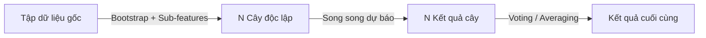
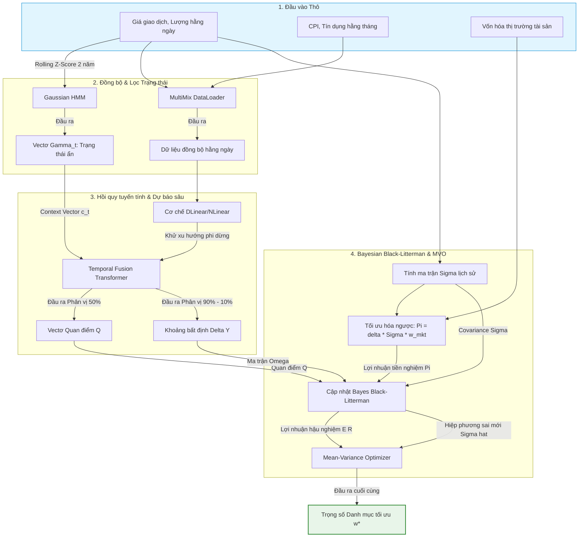

# QUY TRÌNH XỬ LÝ DỮ LIỆU (DATA PROCESSING) VÀ ĐẦU RA (OUTPUT) CỦA 6 MÔ HÌNH

Tài liệu này hệ thống hóa toàn bộ quy trình xử lý dữ liệu từ đầu vào thô, các bước tiền xử lý đặc thù, phép biến đổi đặc trưng, đến định dạng toán học của đầu ra (Output) cho cả 6 mô hình: **FinBERT, GPT-2, XGBoost, Random Forest, PPO Actor-Critic, và TFT-HMM-BL**.

---

## 1. BẢNG TỔNG HỢP SO SÁNH QUY TRÌNH DỮ LIỆU

| Mô hình | Đầu vào thô (Raw Inputs) | Tiền xử lý cốt lõi (Core Preprocessing) | Đặc trưng biểu diễn (Feature Representation) | Đầu ra (Output) & Số chiều toán học (Dimension) |
| :--- | :--- | :--- | :--- | :--- |
| **FinBERT** | Câu văn bản phi cấu trúc (tin tức, báo cáo tài chính). | WordPiece Tokenization (tách từ thành sub-tokens), Thêm các token đặc biệt `[CLS]`, `[SEP]`. | 3 Tensor: Input IDs, Attention Mask, Segment IDs. Kích thước: `[Batch_Size, Seq_Len]`. | Xác suất xác định 3 lớp cảm xúc (Positive, Negative, Neutral). Kích thước: `[Batch_Size, 3]`. |
| **GPT-2** | Câu hoặc đoạn văn bản (Prompt). | Byte-Pair Encoding (BPE) mã hóa cấp độ byte, căn lề độ dài chuỗi (Padding). | Token Embeddings + Positional Embeddings. Kích thước: `[Batch_Size, Seq_Len, Embedding_Dim]`. | Xác suất phân phối cho token kế tiếp trong từ điển. Kích thước: `[Batch_Size, Seq_Len, Vocab_Size]`. |
| **XGBoost** | Dữ liệu dạng bảng (Numeric, Categorical). | Điền khuyết (Imputation), Mã hóa biến phân loại (Encoding), Chuyển sang định dạng DMatrix. | Vectơ đặc trưng số học tĩnh. Kích thước: `[Num_Samples, Num_Features]`. | Giá trị dự báo liên tục (Hồi quy) hoặc Xác suất lớp (Phân loại). Kích thước: `[Num_Samples, 1]`. |
| **Random Forest** | Dữ liệu dạng bảng (Numeric, Categorical). | Không cần chuẩn hóa đặc trưng. Thực hiện lấy mẫu lặp (Bootstrap) và chọn ngẫu nhiên tập con đặc trưng. | Vectơ đặc trưng số học tĩnh cho mỗi cây. Kích thước: `[Sub_Samples, Sub_Features]`. | Giá trị dự báo trung bình hoặc Lớp biểu quyết đa số. Kích thước: `[Num_Samples, 1]`. |
| **PPO Actor-Critic** | Trạng thái môi trường $s_t$ (Giá cổ phiếu, chỉ báo kỹ thuật, ví tài sản). | Chuẩn hóa đặc trưng về Z-score, thu thập chuỗi quỹ đạo (Trajectory) lưu vào buffer. | Vectơ trạng thái môi trường. Kích thước: `[Batch_Size, State_Dim]`. | 1. Hành động phân bổ danh mục (Actor): `[Batch_Size, Action_Dim]`. <br>2. Giá trị trạng thái (Critic): `[Batch_Size, 1]`. |
| **TFT-HMM-BL** | Dữ liệu hỗn hợp: Chuỗi giá giao dịch ngày, chỉ số vĩ mô công bố tháng, vốn hóa thị trường. | 1. Đồng bộ MultiMix.<br>2. Lọc HMM trạng thái.<br>3. Phân tách DLinear hoặc chuẩn hóa NLinear chuỗi thời gian. | Tensor 3D đầu vào TFT: `[Batch_Size, Lookback, Features]` kết hợp Context Vector $c_t$ từ HMM. | Trọng số tối ưu hóa phân bổ vốn danh mục đầu tư ($w^*$). Kích thước: `[N_Assets]` với $\sum w_i = 1, w_i \ge 0$. |

---

## 2. CHI TIẾT PROCESSING PIPELINE & OUTPUT TỪNG MÔ HÌNH

### 2.1. FinBERT (NLP Sentiment Extraction)
```mermaid
flowchart LR
    A[Text thô] -->|WordPiece Tokenizer| B[Token IDs]
    B -->|Transformer Encoder| C[Vectơ CLS]
    C -->|Linear + Softmax| D[Logits: [P, N, Neu]]
```
*   **Quá trình xử lý (Processing):**
    1.  **Tokenization:** Văn bản thô được cắt thành các mảnh từ (Sub-words). Ví dụ: *"underperforming"* $\rightarrow$ `['under', '##perf', '##orming']`.
    2.  **Định cấu trúc:** Thêm token `[CLS]` ở đầu câu để đại diện cho ngữ cảnh phân loại và token `[SEP]` để ngắt câu.
    3.  **Embedding Lookup:** Chuyển đổi mã token thành vectơ số 768 chiều. Cộng thêm vectơ vị trí (Position Embedding) để giữ thứ tự từ.
*   **Đầu ra (Output):**
    -   Vectơ xác suất của 3 lớp: $\text{Prob} = [\text{Positive}, \text{Negative}, \text{Neutral}]$.
    -   *Ý nghĩa:* Chuyển đổi thông tin định tính thành chỉ số định lượng có thể cộng/trừ/nhân/chia hằng ngày.

### 2.2. GPT-2 (Autoregressive Generation / Perplexity Analysis)

*   **Quá trình xử lý (Processing):**
    1.  **Mã hóa BPE:** Biến đổi văn bản thành các byte tokens (từ 0 đến 50256) tránh lỗi mất ký tự.
    2.  **Causal Masking:** Thiết lập ma trận mặt nạ tam giác dưới để nơ-ron tại bước $t$ chỉ nhìn ngược lại $t-1, t-2...$, ngăn chặn rò rỉ tương lai.
*   **Đầu ra (Output):**
    -   Ma trận phân phối từ tiếp theo kích thước `[Seq_Len, Vocab_Size]`.
    -   *Ý nghĩa:* Sinh báo cáo tài chính tự động hoặc tính chỉ số Perplexity để đo lường mức độ bất thường của thông tin báo chí kinh tế.

### 2.3. XGBoost (Gradient Boosting Trees)
```mermaid
flowchart LR
    A[Bảng đặc trưng] -->|DMatrix Conversion| B[Gradient/Hessian]
    B -->|Tuần tự dựng cây| C[CART Ensemble]
    C -->|Cộng dồn w*| D[Dự báo: [Y_pred]]
```
*   **Quá trình xử lý (Processing):**
    1.  **Default Direction for Missing values:** Khi dữ liệu bị trống (ví dụ: ngày nghỉ lễ không có thanh khoản), XGBoost phân nhánh mẫu vào cả hai phía Trái/Phải để chọn hướng đi làm giảm Loss nhiều nhất, thiết lập đó làm hướng đi mặc định.
    2.  **DMatrix:** Nén dữ liệu theo hàng và cột (CSC - Compressed Sparse Column) giúp CPU duyệt nhanh các điểm cắt phân tách.
*   **Đầu ra (Output):**
    -   Mỗi mẫu dữ liệu $x_i$ cho ra một giá trị dự báo $\hat{y}_i = \sum \eta \cdot f_t(x_i)$.
    -   *Ý nghĩa:* Dự báo xu hướng giá lên/xuống (Classification) hoặc giá trị tỷ suất sinh lời cụ thể (Regression).

### 2.4. Random Forest (Bagging Decision Trees)

*   **Quá trình xử lý (Processing):**
    1.  **Bootstrap Sampling:** Lấy mẫu ngẫu nhiên có hoàn lại tạo ra các tập con dữ liệu có kích thước bằng tập gốc nhưng chứa khoảng 63.2% mẫu độc nhất, phần còn lại bị lặp. Điều này giúp các cây con không giống nhau.
    2.  **Feature Randomization:** Tại mỗi bước phân nhánh nút, chỉ chọn lọc điểm cắt từ một nhóm nhỏ các biến đặc trưng ngẫu nhiên để đa dạng hóa cấu trúc cây.
*   **Đầu ra (Output):**
    -   Vectơ dự báo trung bình hoặc biểu quyết có kích thước `[Num_Samples, 1]`.
    -   *Ý nghĩa:* Cung cấp dự báo cơ sở (Baseline) ổn định, bền bỉ với nhiễu và cung cấp điểm số Feature Importance.

### 2.5. PPO Actor-Critic (Reinforcement Learning Pipeline)
```mermaid
flowchart TD
    A[State s_t: Đặc trưng thị trường] --> B[Mạng Actor] & C[Mạng Critic]
    B -->|Action a_t| D[Vectơ phân bổ w]
    C -->|Value V| E[Điểm đánh giá trạng thái]
    D & E -->|Tương tác môi trường| F[Lưu trữ Buffer: [s, a, r, s']]
```
*   **Quá trình xử lý (Processing):**
    1.  **State Representation:** Chuyển đổi dữ liệu thị trường hằng ngày cùng thông số danh mục đầu tư hiện tại thành vectơ trạng thái $s_t$.
    2.  **Trajectory Processing:** Trải nghiệm trên môi trường giả lập (Backtest environment), ghi lại chuỗi quỹ đạo hành động và phần thưởng. Tính toán giá trị lợi thế GAE ($\hat{A}_t$) trước khi đưa vào lô tối ưu hóa chính sách.
*   **Đầu ra (Output):**
    -   **Actor Output:** Phân phối chính sách $\pi(a|s)$ biểu diễn dưới dạng vectơ tỷ trọng tài sản phân bổ (kích thước `[Action_Dim]`).
    -   **Critic Output:** Giá trị trạng thái $V_\phi(s)$ (kích thước `[1]`).

### 2.6. TFT-HMM-BL (Hybrid Framework Pipeline)
Quy trình xử lý dữ liệu tích hợp đa tầng của hệ thống lai ghép được mô tả chi tiết dưới đây:



*   **Quá trình xử lý (Processing):**
    1.  **HMM Regime Classification:** Nhóm 5 biến thị trường (Biến động SP500, VIX, Amihud, Return Dispersion, Hose Volume) được chuẩn hóa Z-score và đưa qua Gaussian HMM để lấy vectơ xác suất trạng thái $\gamma_t$.
    2.  **MultiMix & Linear Scaling:** Dữ liệu vĩ mô tháng được đồng bộ sang tần suất ngày bằng MultiMix. Sau đó chuỗi được đi qua khối NLinear để trừ đi giá trị cuối cùng nhằm ổn định trung bình chuỗi đầu vào.
    3.  **TFT Quantile Forecasting:** Đầu vào là Tensor 3D `[Batch_Size, Lookback, Features]` kết hợp với vectơ trạng thái HMM làm đầu vào ngữ cảnh. Dự báo đồng thời tại 3 phân vị.
    4.  **Bayesian Black-Litterman:** Lợi nhuận tiền nghiệm $\Pi$ được tính từ ma trận hiệp phương sai $\Sigma$ và phân bổ vốn hóa thị trường $w_{mkt}$. Tích hợp với quan điểm $Q$ và ma trận $\Omega$ từ TFT để cho ra phân phối hậu nghiệm.
    5.  **MVO:** Đưa lợi nhuận kỳ vọng hậu nghiệm và ma trận hiệp phương sai mới vào bài toán tối ưu hóa bậc hai có ràng buộc không bán khống.
*   **Đầu ra (Output):**
    -   Vectơ trọng số danh mục tối ưu $w^* \in \mathbb{R}^{N_{\text{assets}}}$ thỏa mãn $\sum w_j^* = 1$ và $w_j^* \ge 0$.
    -   *Ý nghĩa:* Tỷ lệ phần trăm phân bổ vốn tối ưu vào từng tài sản để giao dịch trong chu kỳ tiếp theo.
