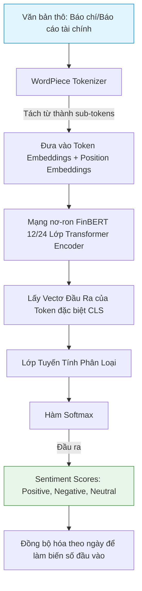

# FinBERT: Financial Sentiment Analysis Model

## 1. FinBERT là gì và Cách xử lý/Sử dụng dữ liệu?
**FinBERT** là một mô hình ngôn ngữ lớn chuyên biệt (Domain-Specific Language Model) được phát triển dựa trên kiến trúc **BERT (Bidirectional Encoder Representations from Transformers)**. Mô hình này được tinh chỉnh (fine-tuned) trên tập dữ liệu văn bản tài chính khổng lồ bao gồm: báo cáo tài chính, tin tức kinh tế, cuộc họp cổ đông (earnings call transcripts), và thông tin mạng xã hội.

### Cách xử lý và Sử dụng dữ liệu:
* **Dữ liệu đầu vào:** Văn bản thô (Tin tức, báo cáo tài chính hằng ngày).
* **Mã hóa (Tokenization):** Sử dụng thuật toán **WordPiece Tokenizer** để tách từ thành các token hoặc sub-token nhằm giải quyết các từ ngoài từ điển (Out-Of-Vocabulary - OOV).
* **Vectơ hóa:** Chuyển đổi chuỗi token thành các vectơ biểu diễn (Embeddings) bao gồm: Token Embeddings, Segment Embeddings, và Position Embeddings.
* **Dữ liệu đầu ra:** 
  1. Các điểm số phân loại cảm xúc (Sentiment Logits): Tích cực (Positive), Tiêu cực (Negative), và Trung lập (Neutral).
  2. Vectơ biểu diễn ngữ cảnh tài chính (Sentence Embeddings) phục vụ cho các mô hình học máy khác.

---

## 2. FinBERT giải quyết vấn đề gì?
Trong thị trường tài chính, thông tin không chỉ tồn tại dưới dạng số (giá, khối lượng) mà phần lớn nằm ở dạng phi cấu trúc (văn bản). FinBERT giải quyết bài toán **Trích xuất tâm lý thị trường (Sentiment Extraction)**:
* Chuyển hóa tin tức và báo cáo tài chính thành các chỉ số định lượng hằng ngày.
* Đo lường mức độ phản ứng của dư luận hoặc các thông tin bất ngờ (news shocks) để làm biến đầu vào cho các mô hình dự báo tài sản.
* Nhận diện sắc thái ngôn từ đặc thù của tài chính (ví dụ: trong tài chính, từ "liability" là một nghĩa tiêu cực/nợ, hay "share" mang nghĩa cổ phiếu chứ không chỉ là chia sẻ).

---

## 3. Cách FinBERT hoạt động
FinBERT kế thừa cơ chế **Self-Attention hai chiều (Bidirectional)** từ Transformer Encoder. Mô hình cho phép mỗi từ trong câu tương tác và học mối quan hệ với tất cả các từ khác xung quanh nó, bất kể vị trí trước hay sau.

### Quy trình hoạt động:
1. **Lớp Tokenizer:** Tách câu văn bản đầu vào thành chuỗi token.
2. **Transformer Blocks:** Đi qua chuỗi các lớp Multi-Head Self-Attention để trích xuất ngữ cảnh.
3. **Classification Head:** Đưa vectơ đầu ra của token đặc biệt `[CLS]` (đại diện cho toàn bộ câu) qua lớp tuyến tính và hàm Softmax để dự đoán xác suất cho 3 lớp cảm xúc.

---

## 4. Các công thức toán học trong FinBERT

### 4.1. Cơ chế Self-Attention (Sự chú ý bản thân)
Công thức tính điểm chú ý từ các ma trận Query ($Q$), Key ($K$), và Value ($V$):
$$\text{Attention}(Q, K, V) = \text{softmax}\left(\frac{Q K^T}{\sqrt{d_k}}\right) V$$
* *Ý nghĩa:* Tính toán mức độ liên quan giữa các từ. Việc chia cho căn bậc hai của kích thước Key $\sqrt{d_k}$ giúp triệt tiêu gradient bị triệt tiêu khi giá trị tích vô hướng quá lớn trước khi đi qua Softmax.

### 4.2. Layer Normalization (Chuẩn hóa lớp)
Áp dụng sau mỗi khối Attention để ổn định quá trình huấn luyện:
$$\text{LN}(x) = \gamma \odot \frac{x - \mu}{\sqrt{\sigma^2 + \epsilon}} + \beta$$
* *Trong đó:* $\mu$ và $\sigma^2$ lần lượt là kỳ vọng và phương sai của các thành phần đặc trưng trong mẫu. $\gamma$ và $\beta$ là các tham số học được.

### 4.3. Lớp phân loại Softmax
Chuyển đổi điểm số Logits đầu ra từ lớp tuyến tính thành xác suất:
$$P(y_i \mid x) = \frac{e^{z_i}}{\sum_{j=1}^3 e^{z_j}}$$
* *Ý nghĩa:* Đảm bảo tổng xác suất của 3 lớp (Positive, Negative, Neutral) luôn bằng 1.

---

## 5. Các mô hình nhỏ tiền thân
* **Word2Vec & GloVe:** Các mô hình nhúng từ tĩnh (Static Word Embeddings) chỉ biểu diễn một từ bằng một vectơ duy nhất, không thay đổi theo ngữ cảnh câu.
* **RNN & LSTM:** Mô hình chuỗi xử lý tuần tự một chiều. Gặp hạn chế về việc ghi nhớ dài hạn và không thể song song hóa tính toán.
* **Transformer (Vaswani et al., 2017):** Mô hình đầu tiên loại bỏ hoàn toàn cấu trúc tuần tự RNN để chuyển sang cơ chế Self-Attention.
* **BERT (Devlin et al., 2018):** Mô hình nền tảng sử dụng các khối Encoder của Transformer huấn luyện theo phương pháp học không giám sát trên lượng văn bản khổng lồ.

---

## 6. Sơ đồ Data Pipeline của FinBERT

> [!NOTE]
> FinBERT thường được sử dụng ở đầu của Data Pipeline tổng thể để làm sạch dữ liệu văn bản phi cấu trúc và chuyển đổi chúng thành chỉ số sentiment hằng ngày. Chỉ số này sau đó mới được ghép nối với dữ liệu chuỗi thời gian số.
