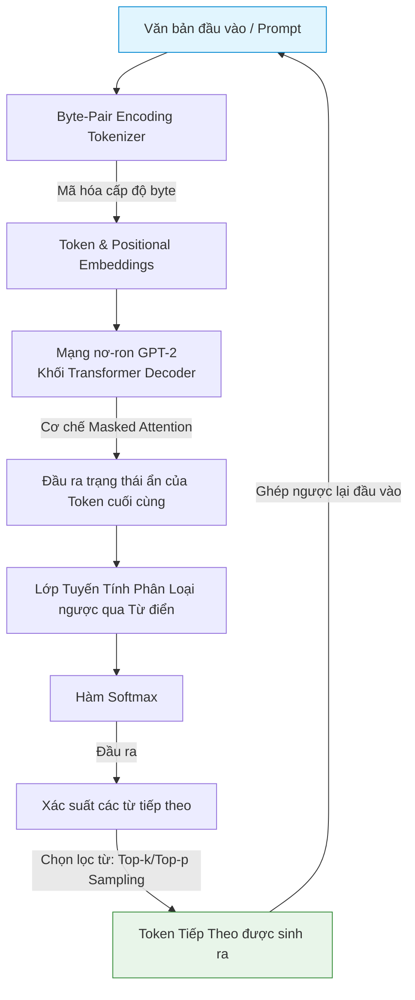

# GPT-2: Generative Pre-trained Transformer 2

## 1. GPT-2 là gì và Cách xử lý/Sử dụng dữ liệu?
**GPT-2 (Generative Pre-trained Transformer 2)** là mô hình ngôn ngữ tự hồi quy (Autoregressive Language Model) được phát triển bởi OpenAI. Không giống như BERT tập trung vào hiểu văn bản (Encoder-only), GPT-2 được thiết kế để tạo văn bản (Decoder-only). Mô hình hoạt động theo nguyên lý dự đoán từ tiếp theo trong chuỗi dựa trên tất cả các từ đã xuất hiện trước đó.

### Cách xử lý và Sử dụng dữ liệu:
* **Dữ liệu đầu vào:** Một chuỗi văn bản (Prompt hoặc chuỗi từ lịch sử).
* **Mã hóa (Tokenization):** Sử dụng thuật toán **Byte-Pair Encoding (BPE)** hoạt động ở cấp độ byte. Thuật toán này giúp nén văn bản hiệu quả và loại bỏ hoàn toàn lỗi từ ngoài từ điển (OOV).
* **Cơ chế Tự hồi quy (Autoregressive):** Dữ liệu được đưa vào theo cấu trúc lũy tiến. Đầu ra của bước $t$ sẽ trở thành một phần đầu vào của bước $t+1$.
* **Dữ liệu đầu ra:** Xác suất phân phối của các token tiếp theo trong từ điển.

---

## 2. GPT-2 giải quyết vấn đề gì?
Trong lĩnh vực định lượng và phân tích tài chính, GPT-2 có thể giải quyết các bài toán sau:
* **Sinh nội dung tài chính tự động:** Tự động tạo bản tóm tắt thị trường, viết báo cáo phân tích từ các chỉ số số liệu đầu vào.
* **Đo lường độ bất thường của thông tin (Perplexity):** Sử dụng chỉ số perplexity của GPT-2 để đo lường mức độ bất ngờ hoặc độ dị biệt của một thông báo tài chính/báo cáo thu nhập so với dữ liệu lịch sử.
* **Trích xuất đặc trưng sinh (Generative Feature Extraction):** Tạo ra các vectơ nhúng đại diện cho chuỗi văn bản tài chính dài để làm đặc trưng huấn luyện cho các mô hình dự báo.

---

## 3. Cách GPT-2 hoạt động
GPT-2 sử dụng các khối **Transformer Decoder**. Sự khác biệt cốt lõi là việc sử dụng **Mặt nạ nhân quả (Causal Masking)** trong lớp Self-Attention. Điều này ngăn cản mô hình "nhìn trộm" các từ ở tương lai trong quá trình huấn luyện.

### Quy trình hoạt động:
1. **Tokenization & Embedding:** Chuyển văn bản thành mã token và ánh xạ thành vectơ, cộng thêm vectơ vị trí (Positional Embeddings).
2. **Masked Multi-Head Attention:** Mô hình tính toán sự chú ý nhưng áp dụng mặt nạ che đi tất cả các vị trí đứng sau token hiện tại.
3. **Feed Forward Network & LayerNorm:** Chuẩn hóa dữ liệu và truyền qua mạng nơ-ron truyền thẳng tích hợp hàm kích hoạt GeLU.
4. **Prediction:** Đầu ra được nhân với ma trận nhúng đảo để tính xác suất phân phối cho token tiếp theo qua Softmax.

---

## 4. Các công thức toán học trong GPT-2

### 4.1. Masked Self-Attention (Sự chú ý tự động có mặt nạ)
$$\text{Attention}(Q, K, V) = \text{softmax}\left(\frac{Q K^T}{\sqrt{d_k}} + M\right) V$$
* *Trong đó:* $M$ là ma trận mặt nạ (Mask matrix) có kích thước tương đương với độ dài chuỗi $L \times L$. Giá trị của $M$ được định nghĩa:
$$M_{ij} = \begin{cases} 0 & \text{nếu } i \ge j \\ -\infty & \text{nếu } i < j \end{cases}$$
* *Ý nghĩa:* Khi cộng $-\infty$ vào các vị trí tương lai ($i < j$), hàm Softmax sẽ gán xác suất chú ý tại các vị trí đó bằng $0$ ($e^{-\infty} = 0$). Điều này đảm bảo tính nhân quả.

### 4.2. Hàm kích hoạt GELU (Gaussian Error Linear Unit)
Khác với BERT và các mô hình cũ dùng ReLU, GPT-2 sử dụng GELU để kích hoạt phi tuyến:
$$\text{GELU}(x) = x \Phi(x) = x \cdot P(X \le x), \quad X \sim \mathcal{N}(0, 1)$$
Công thức xấp xỉ toán học thường dùng trong tính toán:
$$\text{GELU}(x) \approx 0.5x \left( 1 + \tanh\left( \sqrt{\frac{2}{\pi}} (x + 0.044715 x^3) \right) \right)$$
* *Ý nghĩa:* GELU nhân đầu vào với xác suất của nó dưới phân phối Gauss tích lũy. Khi $x$ âm, đầu ra không bị triệt tiêu hoàn toàn về $0$ như ReLU mà vẫn giữ lại một lượng thông tin nhỏ giúp giảm hiện tượng "chết nơ-ron".

---

## 5. Các mô hình nhỏ tiền thân
* **Mạng ngôn ngữ N-gram:** Dự báo từ tiếp theo dựa trên tần suất xuất hiện của cụm từ cố định có độ dài $N$ trong quá khứ.
* **RNN / LSTM Language Models:** Dự báo tự hồi quy tuần tự nhưng bị giới hạn nghiêm trọng về khả năng song song hóa trong huấn luyện.
* **Transformer Decoder (Vaswani et al., 2017):** Kiến trúc gốc chứa cả bộ mã hóa và giải mã. GPT-2 loại bỏ hoàn toàn bộ mã hóa (Encoder) để giữ lại duy nhất bộ giải mã (Decoder).
* **GPT-1 (Radford et al., 2018):** Phiên bản đầu tiên ứng dụng học bán giám sát (Semi-supervised learning) với quy mô nhỏ hơn.

---

## 6. Sơ đồ Data Pipeline của GPT-2

> [!NOTE]
> Trong các ứng dụng định lượng nâng cao, GPT-2 thường được dùng để đo lường độ bất ổn thông tin (Perplexity) của các báo cáo tài chính bằng cách tính tổng độ bất ngờ của chuỗi từ: $\text{PPL} = \exp\left( -\frac{1}{N} \sum_{i=1}^N \ln P(w_i \mid w_{<i}) \right)$.
