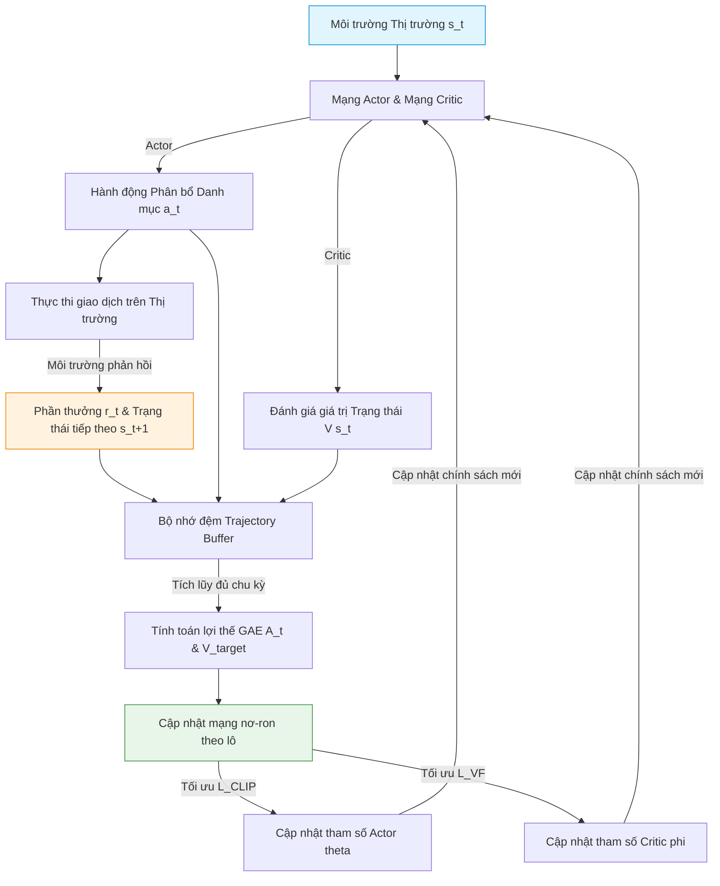

# PPO Actor-Critic: Proximal Policy Optimization

## 1. PPO Actor-Critic là gì và Cách xử lý/Sử dụng dữ liệu?
**PPO Actor-Critic (Proximal Policy Optimization)** là một thuật toán học tăng cường (Reinforcement Learning - RL) thuộc nhóm tối ưu hóa chính sách trực tiếp (Policy Gradient). Thuật toán này sử dụng cấu trúc **Actor-Critic (Diễn viên - Nhà phê bình)** với hai mạng nơ-ron hoạt động song song để học cách đưa ra các quyết định hành động tối ưu trong một môi trường động đầy biến động.

### Cách xử lý và Sử dụng dữ liệu:
* **Dữ liệu đầu vào (Trạng thái - State):** Môi trường cung cấp vectơ trạng thái $s_t$ chứa các đặc trưng thị trường (giá, khối lượng, tỷ suất sinh lời, chỉ báo kỹ thuật) cùng trạng thái danh mục đầu tư hiện tại (tỷ trọng tài sản, số dư tiền mặt).
* **Hành động (Action):** Diễn viên (Actor) đưa ra quyết định hành động $a_t$ (ví dụ: vectơ tỷ trọng phân bổ danh mục mới, hoặc tín hiệu Mua/Bán/Nắm giữ).
* **Phản hồi (Reward):** Sau khi thực thi hành động $a_t$, môi trường trả về phần thưởng $r_t$ (ví dụ: lợi nhuận thu được, hoặc chỉ số Sharpe Ratio của danh mục) và trạng thái tiếp theo $s_{t+1}$.
* **Bộ nhớ đệm (Experience Replay Buffer):** Lưu trữ các bộ thông tin chuyển trạng thái $(s_t, a_t, r_t, s_{t+1}, \log\pi(a_t|s_t))$ dưới dạng các chuỗi quỹ đạo (Trajectories) để thực hiện cập nhật mạng nơ-ron theo lô (Mini-batch).

---

## 2. PPO Actor-Critic giải quyết vấn đề gì?
Trong giao dịch tự động và phân bổ tài sản, PPO giải quyết bài toán **Ra quyết định tối ưu động tuần tự (Sequential Decision Making)**:
* Tìm kiếm chiến lược giao dịch tự động tối ưu hóa lợi nhuận dài hạn có điều chỉnh rủi ro.
* Khắc phục điểm yếu của các mô hình dự báo học máy truyền thống (thường chỉ dự báo giá tiếp theo mà không tối ưu trực tiếp hành động giao dịch và chi phí ma sát giao dịch thực tế).
* Đưa ra chiến lược rebalancing danh mục thích nghi động với các chế độ thị trường.

---

## 3. Cách PPO Actor-Critic hoạt động
PPO Actor-Critic chia nhiệm vụ học tập thành hai mạng độc lập:
1. **Actor Network (Chính sách - Policy $\pi_\theta$):** Nhận trạng thái $s_t$ và xuất ra phân phối xác suất của các hành động có thể thực hiện. Mục tiêu là học chính sách tối ưu hóa tổng phần thưởng kỳ vọng.
2. **Critic Network (Giá trị - Value $V_\phi$):** Nhận trạng thái $s_t$ và dự báo tổng phần thưởng tích lũy kỳ vọng từ thời điểm đó cho đến tương lai (State Value). Mục tiêu là đánh giá xem trạng thái hiện tại là tốt hay xấu để làm "thước đo" cho Actor học tập.

### Cơ chế giới hạn PPO (Clipped Objective):
Các thuật toán Policy Gradient truyền thống rất dễ bị đổ vỡ huấn luyện nếu cập nhật chính sách quá mạnh (gây ra sự thay đổi lớn trong hành vi của Actor). PPO giải quyết vấn đề này bằng cách **kẹp (clipping)** tỷ lệ thay đổi chính sách mới so với chính sách cũ trong một phạm vi hẹp $[1-\epsilon, 1+\epsilon]$.

---

## 4. Các công thức toán học trong PPO Actor-Critic

### 4.1. Tỷ lệ chính sách (Probability Ratio)
Đo lường mức độ thay đổi giữa chính sách mới ($\theta$) và chính sách cũ ($\theta_{old}$):
$$r_t(\theta) = \frac{\pi_\theta(a_t \mid s_t)}{\pi_{\theta_{old}}(a_t \mid s_t)}$$

### 4.2. Hàm mục tiêu xén chính sách (Clipped Surrogate Objective)
Hàm mục tiêu mà mạng Actor tối ưu hóa để cập nhật tham số $\theta$:
$$L^{\text{CLIP}}(\theta) = \hat{\mathbb{E}}_t \left[ \min \left( r_t(\theta) \hat{A}_t, \, \text{clip}(r_t(\theta), 1-\epsilon, 1+\epsilon) \hat{A}_t \right) \right]$$
* *Trong đó:* $\hat{A}_t$ là giá trị lợi thế (Advantage value) tại bước $t$. $\text{clip}$ giới hạn giá trị của $r_t(\theta)$ trong khoảng $[1-\epsilon, 1+\epsilon]$ (thường $\epsilon = 0.2$).
* *Ý nghĩa:* Nếu hành động mang lại lợi thế tốt ($\hat{A}_t > 0$), mô hình muốn tăng xác suất hành động đó nhưng không cho phép tăng quá mức $1+\epsilon$. Ngược lại, nếu hành động tệ ($\hat{A}_t < 0$), mô hình muốn giảm xác suất nhưng không giảm quá mức $1-\epsilon$. Điều này đảm bảo sự ổn định tuyệt đối trong huấn luyện chính sách.

### 4.3. Ước lượng lợi thế tổng quát (Generalized Advantage Estimator - GAE)
Tính toán giá trị lợi thế $\hat{A}_t$ để đánh giá hành động $a_t$ tốt hơn mức trung bình bao nhiêu:
$$\hat{A}_t = \sum_{l=0}^\infty (\gamma \lambda)^l \delta_{t+l}^V$$
$$\delta_t^V = r_t + \gamma V_\phi(s_{t+1}) - V_\phi(s_t)$$
* *Trong đó:* $\delta_t^V$ là sai số chênh lệch thời gian (Temporal Difference - TD error). $\gamma$ là hệ số chiết khấu tương lai. $\lambda$ là tham số điều hòa GAE để cân bằng giữa phương sai và độ lệch.

### 4.4. Hàm mất mát của mạng Critic (Value Function Loss)
Mạng Critic tối ưu hóa tham số $\phi$ bằng cách cực tiểu hóa sai số bình phương giữa giá trị dự báo và phần thưởng thực tế:
$$L^{\text{VF}}(\phi) = \hat{\mathbb{E}}_t \left[ \left( V_\phi(s_t) - V_t^{\text{target}} \right)^2 \right]$$
Với $V_t^{\text{target}} = \hat{A}_t + V_{\phi_{old}}(s_t)$ là mục tiêu giá trị được cập nhật từ thực tế môi trường.

---

## 5. Các mô hình nhỏ tiền thân
* **Q-Learning & Deep Q-Networks (DQN):** Các thuật toán học giá trị hành động (Value-based). Chỉ hoạt động hiệu quả trong không gian hành động rời rạc (ví dụ: chỉ có Mua hoặc Bán), không phù hợp cho phân bổ tỷ trọng liên tục.
* **Policy Gradient (REINFORCE):** Thuật toán tối ưu hóa trực tiếp chính sách thông qua việc nhân Gradient của log xác suất hành động với phần thưởng nhận được. Điểm yếu là phương sai rất cao và cập nhật cực kỳ mất ổn định.
* **Actor-Critic (A2C/A3C):** Sự kết hợp của mạng Actor học chính sách và mạng Critic học giá trị để giảm phương sai của Policy Gradient.
* **TRPO (Trust Region Policy Optimization, 2015):** Thuật toán tiền thân của PPO, sử dụng ràng buộc khoảng cách KL (KL-divergence) để giới hạn bước đi của chính sách. TRPO rất ổn định nhưng đòi hỏi tính toán ma trận Fisher vô cùng phức tạp. PPO đơn giản hóa TRPO bằng cơ chế Clipping.

---

## 6. Sơ đồ Data Pipeline của PPO Actor-Critic

> [!CAUTION]
> Khi áp dụng PPO vào tài chính, hàm phần thưởng (Reward Function) cần được thiết kế cẩn thận. Việc chỉ sử dụng lợi nhuận thô làm phần thưởng có thể dẫn đến việc Actor học cách chấp nhận rủi ro cực đoan. Việc sử dụng các chỉ số như tỷ lệ Sharpe (Sharpe Ratio) hoặc tỷ lệ Sortino là giải pháp thay thế an toàn hơn.
