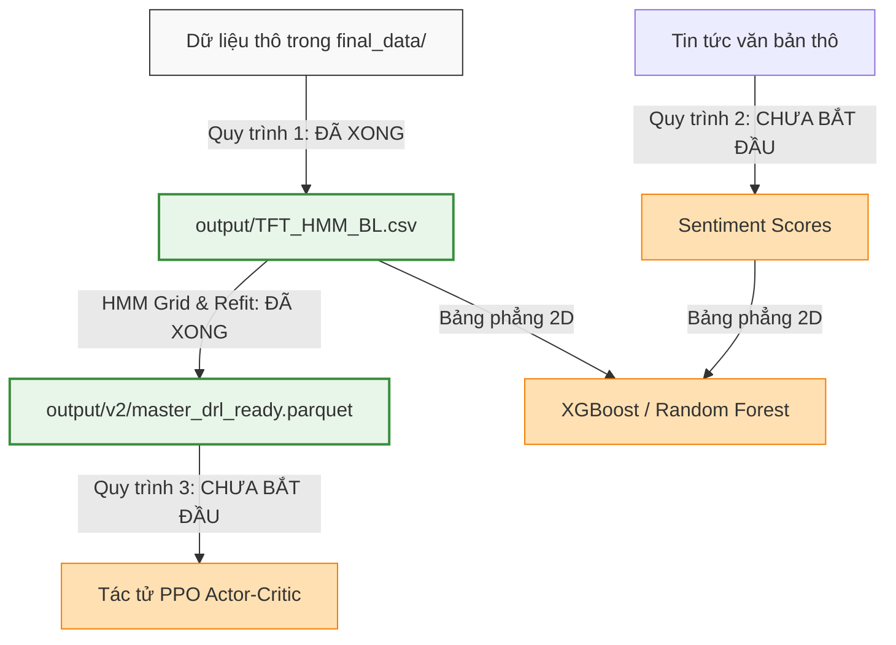

# SO SÁNH & HƯỚNG DẪN CHI TIẾT 3 QUY TRÌNH XỬ LÝ DỮ LIỆU (DATA PIPELINES)

Tài liệu này cung cấp cái nhìn chi tiết và thực tế về **3 Quy trình xử lý dữ liệu (Data Pipelines)** được thiết lập trong workspace của bạn. Tài liệu chỉ rõ vai trò của từng bước, trạng thái hoàn thành thực tế hiện tại, và cấu trúc chi tiết của dữ liệu đầu ra để giúp bạn dễ dàng theo dõi tiến độ dự án.

---

## BẢN ĐỒ TỔNG THỂ TIẾN ĐỘ QUY TRÌNH DỮ LIỆU


---

## 1. QUY TRÌNH 1: MULTI-FREQUENCY SEQUENTIAL PIPELINE (ĐỒNG BỘ ĐA TẦN SUẤT & DỰ BÁO CHUỖI)
> [!NOTE]
> **Mục tiêu chính:** Đồng bộ hóa dữ liệu có tần suất công bố khác nhau (Hằng ngày và Hằng tháng) theo cơ chế phi đồng bộ để tránh rò rỉ dữ liệu tương lai, sau đó chạy mô hình Markov ẩn (HMM) để tự động phân loại trạng thái thị trường ẩn.

### **Trạng thái thực tế:**  `ĐÃ HOÀN THÀNH (100%)`

### Chi tiết các bước xử lý và đầu ra:

| Bước xử lý | Ý nghĩa & Mô tả thuật toán | Tập tin đầu vào | Tập tin & Cấu trúc đầu ra | Trạng thái |
| :--- | :--- | :--- | :--- | :--- |
| **1.1. Tạo biến dẫn xuất (Derived Variables)** | Chuyển đổi dữ liệu gốc thành chỉ báo kỹ thuật tài chính (log return, volatility, volume ratio, Winsorized interest rate). | [final_data/](file:///c:/Users/ADMIN/Desktop/Kaggle/final_data) (dạng thô) | [final_data/*.csv](file:///c:/Users/ADMIN/Desktop/Kaggle/final_data) (đã thêm cột chỉ báo). Xem chi tiết tại [derived_variable.py](file:///c:/Users/ADMIN/Desktop/Kaggle/derived_variable.py) | **Hoàn thành** |
| **1.2. Ghép nối phi đồng bộ (Asynchronous Merge)** | Sử dụng `pd.merge_asof` với `direction="backward"` để ghép dữ liệu tháng vào ngày. CPI/PMI tháng trước chỉ được ghép vào ngày công bố chính thức trong tháng sau. | Các tệp đặc trưng ngày/tháng trong `final_data/` | [output/TFT_HMM_BL.csv](file:///c:/Users/ADMIN/Desktop/Kaggle/output/TFT_HMM_BL.csv) <br> Cấu trúc: `[2361 dòng x 9 cột]`, bao gồm: `time`, `ret_disp`, `amihud_diff_normalized`, `rolling_vol_5`, `close_vix`, `volume_ratio`, `credit_growth_yoy`, `cpi_yoy`, `pmi_vn`. | **Hoàn thành** (Đã tạo notebook chạy trực tiếp tại [multi_freq_seq_pipeline.ipynb](file:///c:/Users/ADMIN/Desktop/Kaggle/data_processing/multi_freq_seq_pipeline.ipynb)) |
| **1.3. Tính biến mục tiêu ẩn (Market Proxy)** | Tính trung bình của tất cả mã cổ phiếu trong `m1_vn46` để làm mốc VN-Index thực tế cho tính toán HMM. | [final_data/m1_vn46.csv](file:///c:/Users/ADMIN/Desktop/Kaggle/final_data/m1_vn46.csv) | DataFrame tích hợp thêm cột `vnindex_log_ret` và `vnindex_close`. | **Hoàn thành** |
| **1.4. Lọc biến & Tính điểm MI** | Tính điểm thông tin tương hỗ (Mutual Information) của 8 biến đặc trưng với biến động thị trường. | [output/TFT_HMM_BL.csv](file:///c:/Users/ADMIN/Desktop/Kaggle/output/TFT_HMM_BL.csv) | Bảng xếp hạng MI score lưu trong bộ nhớ máy tính. | **Hoàn thành** |
| **1.5. Grid Search & Huấn luyện HMM** | Tìm kiếm tổ hợp tốt nhất của $K$ trạng thái ẩn và kích thước biến $n$ dựa trên điểm phạt BIC và kiểm thử OOS. Huấn luyện lại mô hình final bằng 10 seeds ngẫu nhiên. | Dữ liệu đặc trưng chuẩn hóa | **3 sản phẩm chính** lưu tại [output/v2/](file:///c:/Users/ADMIN/Desktop/Kaggle/output/v2):<br>1. `hmm_regimes.csv`: File chứa nhãn trạng thái cứng và xác suất của từng ngày.<br>2. `hmm_model.pkl`: Model HMM đã huấn luyện.<br>3. `master_drl_ready.parquet`: Bảng dữ liệu vĩ mô tích hợp xác suất trạng thái ẩn HMM `[2117 dòng x 12 cột]`. | **Hoàn thành** (Đã tạo notebook chạy trực tiếp tại [hmm_pipeline.ipynb](file:///c:/Users/ADMIN/Desktop/Kaggle/data_processing/hmm_pipeline.ipynb)) |

---

## 2. QUY TRÌNH 2: SENTIMENT-ENHANCED TABULAR PIPELINE (TÍCH HỢP TÂM LÝ TIN TỨC & BẢNG PHẲNG)
> [!NOTE]
> **Mục tiêu chính:** Biến đổi văn bản phi cấu trúc (tin tức tài chính hằng ngày) thành điểm số tâm lý định lượng bằng mô hình ngôn ngữ lớn FinBERT, sau đó kết hợp với chỉ báo kỹ thuật bảng phẳng để huấn luyện các thuật toán cây quyết định (XGBoost, Random Forest).

### **Trạng thái thực tế:** `CHƯA BẮT ĐẦU (0%)` (Đang lập kế hoạch)

### Chi tiết các bước xử lý và đầu ra dự kiến:

```
Trục xử lý NLP tin tức:
[Tin tức thô] ──> [FinBERT Model] ──> [Sentiment Score hằng ngày (-1 đến +1)]
                                                       │
                                                       ▼
[Giá & Chỉ báo ngày] ───────────────────────────> [Ghép nối] ──> [Bảng phẳng 2D] ──> [XGBoost/RF]
```

*   **Bước 2.1: Tin tức Sentiment Extraction (FinBERT Pipeline):**
    *   *Chi tiết:* Đưa tin tức tài chính hằng ngày qua mô hình `FinBERT` (huggingface) để phân loại cảm xúc (Tích cực, Tiêu cực, Trung lập).
    *   *Đầu ra:* Điểm số cảm xúc hằng ngày: $\text{Sentiment\_Score} = \text{Prob(Positive)} - \text{Prob(Negative)}$.
*   **Bước 2.2: Đồng bộ và Ghép nối Bảng phẳng:**
    *   *Chi tiết:* Ghép nối cột chỉ số cảm xúc tin tức với các đặc trưng giá (`TFT_HMM_BL.csv`) theo cột thời gian `time`.
*   **Bước 2.3: Bộ lọc VIF & MI:**
    *   *Chi tiết:* Chạy thuật toán loại bỏ đa cộng tuyến tuyến tính ($VIF > 5.0$).
    *   *Đầu ra của quy trình:* Ma trận dữ liệu phẳng 2D dạng CSV: `[Samples, Features]` dùng trực tiếp cho XGBoost và Random Forest.

---

## 3. QUY TRÌNH 3: STATE-ACTION ENVIRONMENT PIPELINE (TRẠNG THÁI - HÀNH ĐỘNG HƯỚNG MÔI TRƯỜNG)
> [!NOTE]
> **Mục tiêu chính:** Đóng gói toàn bộ thông tin trạng thái thị trường và xác suất HMM thành một môi trường Gym tùy chỉnh (Custom Gym Environment). Tác tử PPO (Actor-Critic) sẽ tương tác với môi trường này để tối ưu hóa trực tiếp tỷ trọng tài sản giao dịch.

### **Trạng thái thực tế:** `CHƯA BẮT ĐẦU (0%)` (Sẵn sàng triển khai vì dữ liệu đầu vào đã chuẩn bị xong ở Quy trình 1)

### Chi tiết cấu trúc môi trường Reinforcement Learning:

*   **Đầu vào của môi trường:** Tệp [master_drl_ready.parquet](file:///c:/Users/ADMIN/Desktop/Kaggle/output/v2/master_drl_ready.parquet) chứa đầy đủ các xác suất trạng thái HMM: `prob_bull`, `prob_sideways`, `prob_bear`.
*   **Vectơ Trạng thái (State/Observation Vector $s_t$):**
    $$s_t = [\text{Features}_{Market, t}, \, \text{Regime}_{HMM, t}, \, w_{\text{portfolio}, t-1}]$$
    *Ý nghĩa:* Giúp tác tử nhận diện xu hướng thị trường cùng tỷ trọng tài sản nắm giữ hiện tại trước khi ra quyết định.
*   **Thiết kế phần thưởng (Reward $r_t$):**
    $$r_t = R_{\text{portfolio}, t} - \mu \cdot \sum_{i=1}^N |w_{i, t} - w_{i, t-1}|$$
    *Ý nghĩa:* Khuyến khích tối đa hóa lợi nhuận danh mục ($R_{\text{portfolio}}$) đồng thời phạt nặng hành vi giao dịch quá nhiều (gây tốn chi phí ma sát giao dịch $\mu$).
*   **Đầu ra của quy trình (Outputs):**
    *   Hồ sơ lịch sử giao dịch (quỹ đạo huấn luyện): $(s_t, a_t, r_t, s_{t+1})$ được lưu trữ vào Replay Buffer để huấn luyện cập nhật trọng số mạng nơ-ron Actor-Critic của mô hình PPO.
