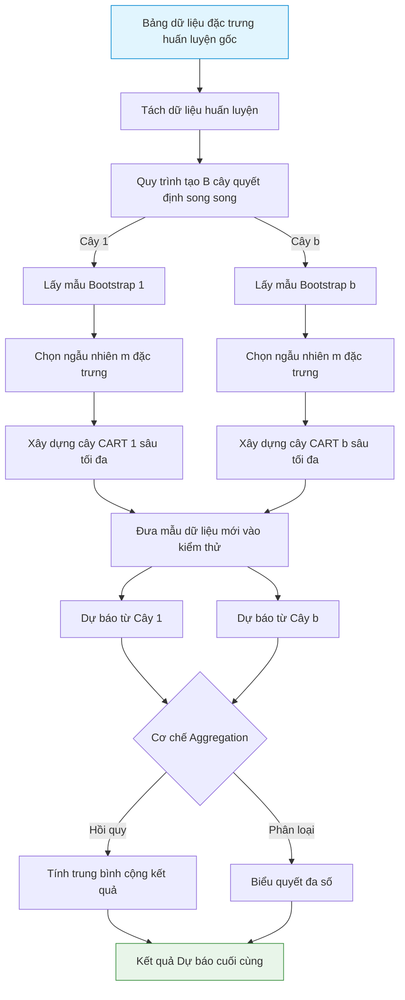

# Random Forest: Ensemble Decision Trees

## 1. Random Forest là gì và Cách xử lý/Sử dụng dữ liệu?
**Random Forest** là một thuật toán học máy học có giám sát (Supervised Learning) thuộc nhóm **Ensemble Learning (Học kết hợp)** sử dụng phương pháp **Bagging (Bootstrap Aggregating)**. Thuật toán này xây dựng một "khu rừng" gồm nhiều cây quyết định hoạt động độc lập và song song với nhau trong quá trình huấn luyện. Kết quả cuối cùng được tổng hợp từ kết quả của tất cả các cây để đưa ra dự báo.

### Cách xử lý và Sử dụng dữ liệu:
* **Dữ liệu đầu vào:** Dữ liệu dạng bảng (Tabular data) với các đặc trưng số học và phân loại.
* **Xử lý ngẫu nhiên dữ liệu (Bootstrap):** Mỗi cây quyết định trong rừng được huấn luyện trên một tập dữ liệu con được lấy mẫu ngẫu nhiên có hoàn lại (Bootstrap Sample) từ tập huấn luyện gốc.
* **Xử lý ngẫu nhiên đặc trưng (Feature Subsetting):** Tại mỗi nút phân tách của từng cây, mô hình chỉ chọn một nhóm ngẫu nhiên các đặc trưng để tìm điểm cắt tối ưu, thay vì duyệt qua toàn bộ các đặc trưng.
* **Dữ liệu đầu ra:** Giá trị trung bình dự báo của các cây (đối với bài toán Hồi quy) hoặc Lớp có số phiếu bầu cao nhất (đối với bài toán Phân loại).

---

## 2. Random Forest giải quyết vấn đề gì?
Random Forest cực kỳ ổn định và giải quyết các bài toán sau:
* **Xây dựng mô hình Baseline ổn định:** Nhờ cơ chế Bagging, Random Forest cực kỳ bền bỉ với hiện tượng quá khớp (Overfitting), hoạt động tốt ngay cả trên các bộ dữ liệu nhỏ hoặc nhiều nhiễu.
* **Hồi quy chỉ số tài chính:** Dự báo lợi nhuận hoặc biến động giá.
* **Đánh giá tầm quan trọng của biến (Feature Importance):** Tính toán xem biến số nào đóng góp nhiều nhất vào việc phân loại hoặc giảm sai số để lọc bỏ các đặc trưng nhiễu.

---

## 3. Cách Random Forest hoạt động
Khác với XGBoost huấn luyện tuần tự để sửa sai số, Random Forest huấn luyện **hoàn toàn song song và độc lập** các cây quyết định. Sức mạnh của Random Forest đến từ sự đa dạng của các cây quyết định (sự kết hợp của các dự báo độc lập sẽ triệt tiêu phương sai sai số của từng cây đơn lẻ).

### Quy trình hoạt động:
1. **Lấy mẫu Bootstrap:** Cho một tập dữ liệu có $N$ mẫu, lấy mẫu ngẫu nhiên có hoàn lại $N$ lần để tạo tập huấn luyện riêng cho một cây.
2. **Xây dựng cây quyết định:**
   - Tại mỗi nút, chọn ngẫu nhiên $m$ đặc trưng từ tổng số $M$ đặc trưng ($m \approx \sqrt{M}$ đối với phân loại, hoặc $m \approx M/3$ đối với hồi quy).
   - Chọn đặc trưng và điểm cắt tối ưu nhất trong nhóm $m$ đặc trưng đó dựa trên chỉ số đo độ tinh khiết (Gini/Entropy/MSE).
   - Tiếp tục phát triển cây đạt độ sâu tối đa mà không thực hiện tỉa cành (pruning).
3. **Lặp lại:** Thực hiện quy trình trên để tạo ra $B$ cây quyết định (thường từ 100 đến 500 cây).
4. **Tổng hợp (Aggregating):**
   - *Phân loại:* Biểu quyết đa số (Majority Voting).
   - *Hồi quy:* Tính trung bình cộng kết quả của $B$ cây.

---

## 4. Các công thức toán học trong Random Forest

### 4.1. Độ vẩn đục Gini (Gini Impurity)
Sử dụng trong bài toán phân loại để đánh giá mức độ "trộn lẫn" của các lớp dữ liệu tại một nút:
$$\text{Gini}(D) = 1 - \sum_{i=1}^C p_i^2$$
* *Trong đó:* $p_i$ là tỷ lệ mẫu thuộc lớp $i$ tại nút đang xét. $C$ là tổng số lớp.
* *Ý nghĩa:* Điểm Gini bằng $0$ biểu thị nút hoàn toàn tinh khiết (tất cả các mẫu thuộc về duy nhất một lớp).

### 4.2. Entropy và Thông tin thu được (Information Gain)
Một chỉ số đo lường độ hỗn loạn thông tin thay thế cho Gini:
$$\text{Entropy}(D) = -\sum_{i=1}^C p_i \log_2(p_i)$$
Độ giảm Entropy sau khi phân tách nút thành các nút con được gọi là Information Gain:
$$\text{Gain}(D, A) = \text{Entropy}(D) - \sum_{v \in \text{Values}(A)} \frac{|D_v|}{|D|} \text{Entropy}(D_v)$$
* *Ý nghĩa:* Cây quyết định sẽ chọn đặc trưng phân tách $A$ sao cho lượng thông tin thu được (Gain) đạt giá trị lớn nhất.

### 4.3. Sai số bình phương trung bình (MSE) cho nút Hồi quy
Trong bài toán hồi quy, tiêu chí phân tách nút dựa trên việc cực tiểu hóa tổng bình phương sai số:
$$\text{MSE} = \frac{1}{N} \sum_{i=1}^N \left( y_i - \bar{y} \right)^2$$
Với $\bar{y} = \frac{1}{N} \sum y_i$ là giá trị trung bình của nhãn của các mẫu tại nút đó.

### 4.4. Cơ chế tổng hợp Bagging (Aggregation)
Dự báo cuối cùng $\hat{y}$ cho mẫu dữ liệu mới $x$ được tính bằng:
* **Hồi quy (Regression):**
$$\hat{y} = \frac{1}{B} \sum_{b=1}^B f_b(x)$$
* **Phân loại (Classification):**
$$\hat{y} = \text{argmax}_{c} \sum_{b=1}^B \mathbb{I}\left( f_b(x) == c \right)$$
Với $B$ là số lượng cây, $f_b(x)$ là dự báo của cây thứ $b$, và $\mathbb{I}$ là hàm chỉ thị (bằng 1 nếu điều kiện đúng, ngược lại bằng 0).

---

## 5. Các mô hình nhỏ tiền thân
* **Decision Tree (CART):** Mô hình cây quyết định đơn lẻ. CART đơn lẻ có xu hướng có phương sai rất cao (high variance) và cực kỳ nhạy cảm với sự thay đổi của dữ liệu.
* **Bootstrap Sampling (Lấy mẫu lặp):** Kỹ thuật thống kê lấy mẫu ngẫu nhiên có hoàn lại để ước lượng phân phối của một thống kê mẫu.
* **Bagging (Bootstrap Aggregating - Leo, 1996):** Ý tưởng kết hợp kết quả của nhiều mô hình huấn luyện độc lập trên các mẫu bootstrap để giảm phương sai sai số mà không làm tăng độ lệch (bias).

---

## 6. Sơ đồ Data Pipeline của Random Forest

> [!NOTE]
> Khác với các mô hình học sâu, Random Forest không yêu cầu chuẩn hóa dữ liệu đầu vào (như Z-score hay Min-Max scaling) vì các thuật toán phân tách nút dựa trên giá trị xếp hạng tương đối của đặc trưng chứ không phụ thuộc vào biên độ vật lý của biến số.
