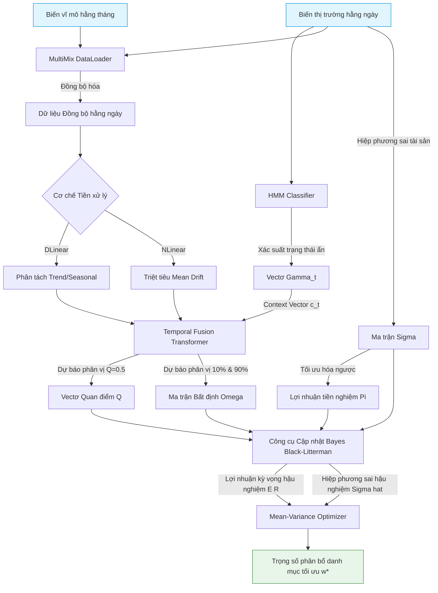

# TFT-HMM-BL: Hybrid Temporal Fusion Transformer, Hidden Markov Model & Black-Litterman Portfolio Optimization

## 1. TFT-HMM-BL là gì và Cách xử lý/Sử dụng dữ liệu?
**TFT-HMM-BL** là một khung hệ thống đầu tư định lượng lai ghép (Hybrid Quantitative Framework). Hệ thống này kết hợp ba phương pháp tiên tiến:
1. **Hidden Markov Model (HMM):** Bộ phân loại học máy không giám sát để nhận diện trạng thái vĩ mô hằng ngày.
2. **Temporal Fusion Transformer (TFT):** Mạng nơ-ron học sâu chuyên biệt cho chuỗi thời gian, tích hợp cơ chế phân tách chuỗi **DLinear** hoặc chuẩn hóa **NLinear**.
3. **Black-Litterman (BL):** Mô hình phân bổ tài sản Bayesian để tối ưu hóa danh mục đầu tư.

### Cách xử lý và Sử dụng dữ liệu:
* **Đồng bộ hóa đa tần suất (MultiMix):** Đồng bộ dữ liệu ngày giao dịch nhanh với dữ liệu vĩ mô công bố chậm hằng tháng (ví dụ: CPI, lạm phát) bằng cách giữ nguyên giá trị công bố gần nhất hằng tháng cho đến khi có báo cáo mới.
* **Xử lý phi dừng:** Sử dụng DLinear để tách xu hướng và mùa vụ, hoặc NLinear để trừ đi giá trị cuối cùng của chuỗi đầu vào nhằm ổn định phân phối dữ liệu tài chính.
* **Tích hợp thông tin:** Dữ liệu thị trường hằng ngày được đưa qua HMM để tính toán vectơ xác suất trạng thái ẩn $\gamma_t$, sau đó vectơ này được đưa trực tiếp vào lớp Variable Selection Network của TFT làm vectơ ngữ cảnh $c_t$ để điều chỉnh động sự chú ý của các biến số.

---

## 2. TFT-HMM-BL giải quyết vấn đề gì?
Hệ thống lai ghép này được thiết kế để giải quyết triệt để 3 điểm yếu lớn của tài chính định lượng hiện đại:
* **Nhạy cảm tham số của tối ưu hóa cổ điển (MVO):** Black-Litterman khắc phục vấn đề này bằng cách neo giữ danh mục vào trạng thái cân bằng thị trường ổn định, tránh sự đảo lộn tỷ trọng cực đoan khi ước lượng kỳ vọng thay đổi nhỏ.
* **Ước lượng độ bất định của mô hình AI:** Khắc phục điểm yếu của các mô hình học sâu chỉ đưa ra dự báo điểm (Point Forecasts). TFT đưa ra dự báo phân vị ($10\%, 50\%, 90\%$), cho phép lượng hóa động độ bất định của quan điểm đầu tư dưới dạng ma trận $\Omega$.
* **Dịch chuyển cấu trúc thị trường (Regime Switching):** Tích hợp HMM giúp mô hình thích nghi nhanh với các giai đoạn hoảng loạn (Risk-Off) hoặc lạm phát cao mà không bị quá khớp dữ liệu lịch sử.

---

## 3. Cách TFT-HMM-BL hoạt động
Quy trình vận hành toán học của hệ thống bao gồm bốn cấu phần chính nối tiếp nhau:
1. **Nhận dạng trạng thái (HMM):** Ước lượng xác suất hậu nghiệm trạng thái vĩ mô hằng ngày $\gamma_t$ từ các chỉ số biến động, thanh khoản nội địa và quốc tế.
2. **Dự báo phân vị (TFT):** Sử dụng mạng tự chú ý đa đầu giải thích được (Interpretable Multi-Head Attention) kết hợp các khối GLU và GRN để đưa ra dự báo phân vị tỷ suất sinh lời tài sản.
3. **Cập nhật Bayesian (Black-Litterman):** Sử dụng trung vị dự báo của TFT làm quan điểm đầu tư $Q$, khoảng phân vị làm độ bất định $\Omega$, kết hợp với lợi nhuận cân bằng thị trường tiền nghiệm $\Pi$ để tính lợi nhuận hậu nghiệm $E(R)$ và ma trận hiệp phương sai mới $\hat{\Sigma}$.
4. **Tối ưu hóa:** Giải bài toán tối ưu hóa Mean-Variance có ràng buộc để tìm trọng số phân bổ vốn tối ưu $w^*$.

---

## 4. Các công thức toán học trong TFT-HMM-BL

### 4.1. Hidden Markov Model (HMM)
Tính vectơ xác suất hậu nghiệm trạng thái vĩ mô hằng ngày bằng thuật toán Forward-Backward:
$$\alpha_t(j) = \left( \sum_{i=1}^4 \alpha_{t-1}(i) a_{ij} \right) b_j(O_t), \quad \gamma_{t, j} = \frac{\alpha_t(j)}{\sum_{k=1}^4 \alpha_t(k)}$$
Trong đó $b_j(O_t)$ tuân theo phân phối Gaussian đa biến của vectơ quan sát vĩ mô $O_t$.

### 4.2. Khối Phân tách DLinear & Chuẩn hóa NLinear
* **DLinear:**
$$X_{\text{Trend}} = \text{AvgPool}(X), \quad X_{\text{Seasonal}} = X - X_{\text{Trend}}$$
$$\hat{Y}_{\text{DLinear}} = W_{\text{Trend}} X_{\text{Trend}} + W_{\text{Seasonal}} X_{\text{Seasonal}} + b$$
* **NLinear:**
$$\tilde{X} = X - \mathbf{1} X_L$$
$$\hat{Y}_{\text{NLinear}} = (W \tilde{X} + b) + \mathbf{1} X_L$$

### 4.3. Các cấu phần Gated của TFT
* **Gated Linear Unit (GLU):**
$$\text{GLU}(\gamma) = \sigma(W_1 \gamma + b_1) \odot (W_2 \gamma + b_2)$$
* **Gated Residual Network (GRN):**
$$\text{GRN}(a, c) = \text{LayerNorm}(a + \text{GLU}(\eta_2))$$
$$\eta_2 = W_3 \eta_1 + b_3, \quad \eta_1 = \text{ELU}(W_4 a + W_5 c + b_4)$$
Trong đó $c$ là vectơ ngữ cảnh vĩ mô được trích xuất từ xác suất trạng thái ẩn $\gamma_t$ của HMM.

### 4.4. Công thức Cập nhật Bayes Black-Litterman
Tích hợp lợi nhuận tiền nghiệm $\Pi$ và quan điểm dự báo của TFT ($Q$) để tính toán kỳ vọng hậu nghiệm $E(R)$ và hiệp phương sai $\hat{\Sigma}$:
$$E(R) = \left[(\tau \Sigma)^{-1} + P^T \Omega^{-1} P\right]^{-1} \left[(\tau \Sigma)^{-1} \Pi + P^T \Omega^{-1} Q\right]$$
$$\hat{\Sigma} = \Sigma + \left[(\tau \Sigma)^{-1} + P^T \Omega^{-1} P\right]^{-1}$$
* *Trong đó:* $\Omega_{k, k} = c \cdot \left( \hat{y}_{k}^{(0.9)} - \hat{y}_{k}^{(0.1)} \right)^2$ biểu thị độ bất định của quan điểm thứ $k$ lấy từ khoảng cách phân vị dự báo của TFT.

---

## 5. Các mô hình nhỏ tiền thân
* **Hidden Markov Model (HMM):** Mô hình thống kê chuỗi thời gian phân loại trạng thái ẩn cổ điển.
* **Standard Transformer (2017):** Kiến trúc dịch chuyển chú ý dạng chuỗi nhưng không tối ưu cho dữ liệu bảng tài chính và chuỗi thời gian phi dừng.
* **DLinear & NLinear (LTSF-Linear, 2023):** Các kiến trúc tuyến tính siêu nhẹ chứng minh sự vượt trội trong việc loại bỏ xu hướng phi dừng so với Transformer truyền thống.
* **Temporal Fusion Transformer (TFT, Lim et al., 2021):** Kiến trúc học sâu cải tiến kết hợp Transformer với các khối chọn lọc biến và cơ chế gated để dự báo phân vị giải thích được.
* **Markowitz Mean-Variance Optimization (1952):** Mô hình phân bổ danh mục đầu tư nguyên thủy.
* **Black-Litterman Model (1990):** Mô hình kết hợp Bayesian để khắc phục sự nhạy cảm tham số của Markowitz.

---

## 6. Sơ đồ Data Pipeline của TFT-HMM-BL

