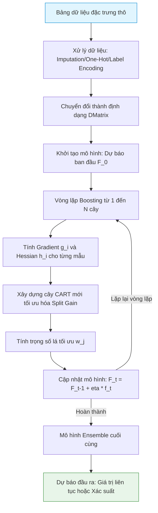

# XGBoost: Extreme Gradient Boosting

## 1. XGBoost là gì và Cách xử lý/Sử dụng dữ liệu?
**XGBoost (Extreme Gradient Boosting)** là một thuật toán học máy có giám sát (Supervised Learning) cực kỳ mạnh mẽ dựa trên cấu trúc cây quyết định (Decision Trees) và kỹ thuật Boosting. XGBoost tối ưu hóa thuật toán Gradient Boosting truyền thống bằng cách tích hợp các kỹ thuật phần cứng song song hóa, xử lý dữ liệu khuyết thiếu tự động và cơ chế điều chuẩn (Regularization) để tránh hiện tượng quá khớp (Overfitting).

### Cách xử lý và Sử dụng dữ liệu:
* **Dữ liệu đầu vào:** Dữ liệu dạng bảng (Tabular data) chứa các đặc trưng số học (Numeric features) và phân loại (Categorical features).
* **Xử lý giá trị thiếu (Missing Values):** Tự động học hướng đi tối ưu cho các mẫu bị thiếu giá trị tại mỗi nút phân tách của cây quyết định (Default Direction).
* **Định dạng dữ liệu:** Dữ liệu thường được chuyển đổi thành cấu trúc **DMatrix** tối ưu hóa bộ nhớ và tốc độ truy cập của CPU/GPU.
* **Dữ liệu đầu ra:** Dự đoán liên tục cho bài toán Hồi quy (Regression) hoặc Xác suất phân lớp cho bài toán Phân loại (Classification).

---

## 2. XGBoost giải quyết vấn đề gì?
XGBoost là "ông vua" trong việc xử lý các bài toán trên dữ liệu dạng bảng có cấu trúc:
* **Dự báo hướng đi giá tài sản:** Phân loại xem ngày mai giá cổ phiếu tăng ($1$) hay giảm ($0$) dựa trên các chỉ báo kỹ thuật số.
* **Hồi quy điểm số tài chính:** Dự báo trực tiếp tỷ suất sinh lời của tài sản hoặc khối lượng giao dịch.
* **Phân bổ tín dụng & Đánh giá rủi ro:** Xếp hạng tín dụng người vay tiền hoặc dự báo xác suất vỡ nợ (Default probability).

---

## 3. Cách XGBoost hoạt động
XGBoost hoạt động theo cơ chế **Additive Training (Huấn luyện cộng dồn)**. Thuật toán xây dựng các cây quyết định một cách tuần tự. Cây thứ $t$ sẽ tập trung sửa chữa sai số dự báo (Residuals) của tổ hợp $t-1$ cây trước đó.

### Quy trình hoạt động:
1. **Khởi tạo:** Bắt đầu bằng một dự đoán hằng số ban đầu (thường là giá trị trung bình của nhãn).
2. **Tính toán Gradient:** Tại mỗi vòng lặp, tính toán đạo hàm bậc nhất (Gradient) và đạo hàm bậc hai (Hessian) của hàm mất mát cho từng mẫu dữ liệu.
3. **Xây dựng cây mới:** Tạo ra một cây quyết định mới bằng cách tìm kiếm cấu trúc cây tối ưu hóa điểm số suy giảm hàm mất mát (Gain) tại mỗi nút phân tách.
4. **Cập nhật dự đoán:** Cộng dự đoán của cây mới nhân với hệ số co hẹp (Learning rate / Shrinkage) vào mô hình tổng thể.

---

## 4. Các công thức toán học trong XGBoost

### 4.1. Hàm mục tiêu tối ưu hóa (Objective Function)
Tại vòng lặp thứ $t$, hàm mục tiêu cần tối ưu hóa bao gồm hàm mất mát của dữ liệu và thành phần điều chuẩn độ phức tạp của cây:
$$\mathcal{L}^{(t)} = \sum_{i=1}^n l\left(y_i, \hat{y}_i^{(t-1)} + f_t(x_i)\right) + \Omega(f_t)$$
* *Trong đó:* $\Omega(f_t)$ là hàm phạt độ phức tạp của cây thứ $t$:
$$\Omega(f_t) = \gamma T + \frac{1}{2} \lambda \sum_{j=1}^T w_j^2$$
Với $T$ là số lượng lá của cây, $w_j$ là trọng số (giá trị dự báo) tại lá thứ $j$. $\gamma$ và $\lambda$ là các siêu tham số điều chuẩn.

### 4.2. Khai triển Taylor bậc hai của Hàm mất mát
Để thuật toán có thể chạy nhanh trên bất kỳ hàm mất mát khả vi nào, XGBoost sử dụng xấp xỉ Taylor bậc hai:
$$\mathcal{L}^{(t)} \approx \sum_{i=1}^n \left[ l(y_i, \hat{y}_i^{(t-1)}) + g_i f_t(x_i) + \frac{1}{2} h_i f_t^2(x_i) \right] + \Omega(f_t)$$
* *Trong đó:* $g_i$ và $h_i$ lần lượt là đạo hàm bậc nhất (Gradient) và bậc hai (Hessian) của hàm mất mát $l$ theo dự báo tại bước trước đó $\hat{y}_i^{(t-1)}$:
$$g_i = \frac{\partial l(y_i, \hat{y}_i^{(t-1)})}{\partial \hat{y}_i^{(t-1)}}, \quad h_i = \frac{\partial^2 l(y_i, \hat{y}_i^{(t-1)})}{\partial \left(\hat{y}_i^{(t-1)}\right)^2}$$

### 4.3. Trọng số lá tối ưu (Optimal Leaf Weight)
Nếu cấu trúc cây đã được xác định, trọng số tối ưu $w_j^*$ tại lá thứ $j$ được tính bằng cách triệt tiêu đạo hàm của hàm mục tiêu theo $w_j$:
$$w_j^* = -\frac{\sum_{i \in I_j} g_i}{\sum_{i \in I_j} h_i + \lambda}$$
Với $I_j$ là tập hợp các chỉ số của các mẫu dữ liệu rơi vào lá thứ $j$.

### 4.4. Điểm số phân tách nút (Split Gain)
Khi xây dựng cây, XGBoost duyệt qua các đặc trưng và chọn điểm cắt tối ưu hóa điểm số Gain lớn nhất:
$$\text{Gain} = \frac{1}{2} \left[ \frac{\left(\sum_{i \in I_L} g_i\right)^2}{\sum_{i \in I_L} h_i + \lambda} + \frac{\left(\sum_{i \in I_R} g_i\right)^2}{\sum_{i \in I_R} h_i + \lambda} - \frac{\left(\sum_{i \in I} g_i\right)^2}{\sum_{i \in I} h_i + \lambda} \right] - \gamma$$
* *Ý nghĩa:* Tính toán xem việc tách nút hiện tại thành lá Trái ($I_L$) và lá Phải ($I_R$) có làm giảm hàm mục tiêu nhiều hơn chi phí phạt thêm một lá mới ($\gamma$) hay không.

---

## 5. Các mô hình nhỏ tiền thân
* **Decision Tree (CART):** Cây quyết định phân loại và hồi quy cơ bản. Rất dễ bị quá khớp và nhạy cảm với dữ liệu.
* **AdaBoost (Adaptive Boosting):** Thuật toán boosting đầu tiên, tăng trọng số của các mẫu bị phân loại sai ở bước trước.
* **Gradient Boosting Machine (GBM):** Mô hình tối ưu hóa hàm mục tiêu bằng phương pháp hạ độ dốc (Gradient Descent). Điểm yếu của GBM truyền thống là chỉ sử dụng xấp xỉ Taylor bậc một và thiếu cơ chế điều chuẩn tự động.

---

## 6. Sơ đồ Data Pipeline của XGBoost

> [!TIP]
> XGBoost có thuật toán tính toán Feature Importance rất mạnh mẽ dựa trên chỉ số **Gain** (tổng mức giảm hàm mục tiêu do biến đó mang lại), giúp nhà nghiên cứu tài chính thực hiện chọn lọc đặc trưng (Feature Selection) hiệu quả.
