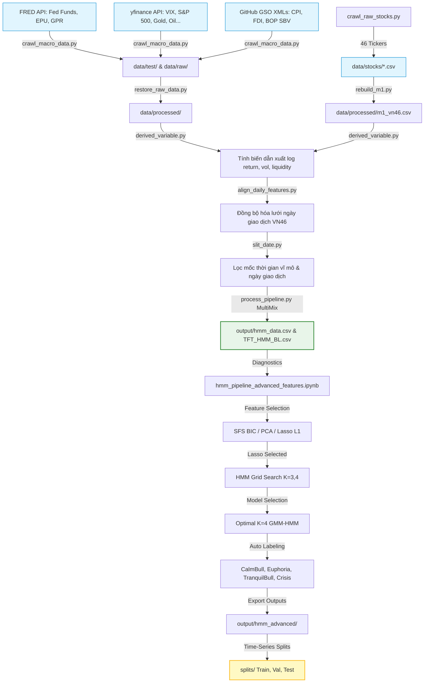
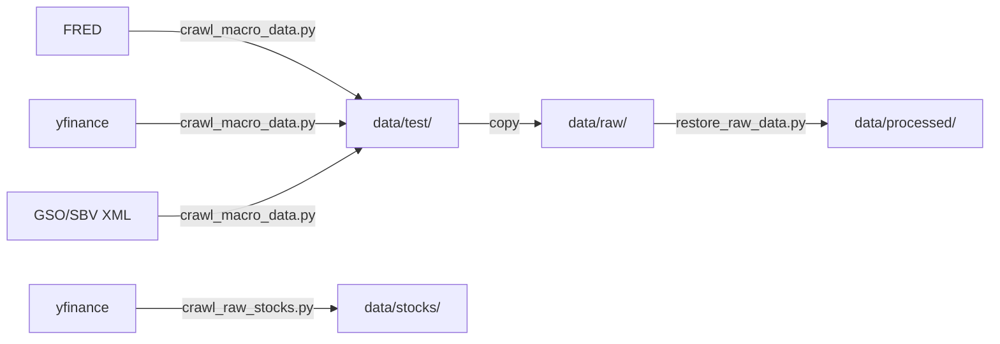
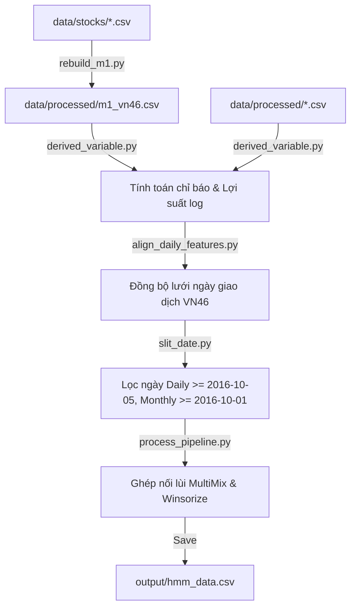
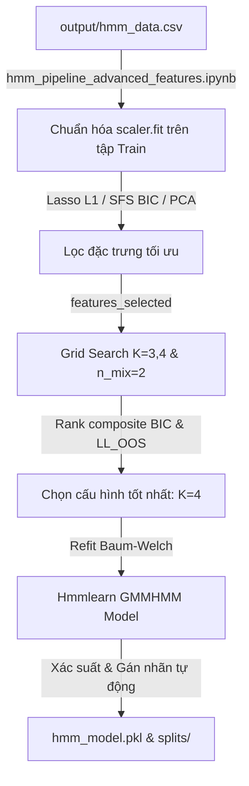

# TỔNG QUAN TIẾN ĐỘ DỰ ÁN & HƯỚNG DẪN CHI TIẾT DATA PIPELINE HMM

Tài liệu này tổng hợp chi tiết toàn bộ các giai đoạn phát triển hệ thống đầu tư định lượng, phân tích cấu trúc từng tệp tin mã nguồn, giải thích ý nghĩa nghiệp vụ của từng bước xử lý, đồng thời phác thảo sơ đồ quy trình và đề xuất các điểm cần cải tiến.

---

## 1. SƠ ĐỒ KIẾN TRÚC TOÀN HỆ THỐNG

Dưới đây là sơ đồ luồng dữ liệu tổng quát đi từ dữ liệu thô đa nguồn, qua tiền xử lý đa tần suất, mô hình hóa trạng thái ẩn (HMM) nâng cao, và chuẩn bị dữ liệu cho mô hình học tăng cường (DRL).



---

## 2. CHI TIẾT GIAI ĐOẠN 1: THU THẬP & KHÔI PHỤC DỮ LIỆU (DATA COLLECTION & RESTORATION)

Giai đoạn này đảm bảo nguồn dữ liệu thô đầu vào đa dạng bao gồm giá cổ phiếu hằng ngày, chỉ số tài chính thế giới, và các số liệu vĩ mô của Việt Nam được cập nhật liên tục và nhất quán.



### Chi tiết từng tệp tin và quy trình:

### 1. `crawl_macro_data.py` (Mã nguồn: [crawl_macro_data.py](file:///C:/Users/ADMIN/Desktop/Kaggle/src/data_collection/crawl_macro_data.py))
* **Ý nghĩa:** Đây là crawler trung tâm thu thập dữ liệu vĩ mô và chỉ số thế giới.
* **Các bước thực hiện:**
  1. Sử dụng thư viện `yfinance` để tải dữ liệu giá đóng cửa lịch sử của VIX (`^VIX`), S&P 500 (`^GSPC`), USD/VND (`USDVND=X`), Brent Oil, Gold, Copper, DXY, và các chỉ số quốc tế khác.
  2. Sử dụng thư viện `pandas_datareader` hoặc API để lấy số liệu lãi suất quỹ liên bang (Fed Funds Rate), chỉ số bất định chính sách kinh tế (EPU), và chỉ số rủi ro địa chính trị (GPR) từ cơ sở dữ liệu FRED.
  3. Gửi truy vấn HTTP tải các tệp tin XML lưu trữ số liệu vĩ mô Việt Nam (Báo cáo CPI, BOP, lãi suất SBV) từ kho lưu trữ dữ liệu vĩ mô. Sau đó, phân tích thẻ XML (parsing) để trích xuất CPI, tăng trưởng tín dụng và lãi suất liên ngân hàng.
  4. Gap-filling (điền khuyết) dữ liệu bị thiếu vào các ngày lễ và cuối tuần bằng phương pháp điền tiến (forward fill).
  5. Ghi kết quả đầu ra vào thư mục `data/test/`.

### 2. `crawl_raw_stocks.py` (Mã nguồn: [crawl_raw_stocks.py](file:///C:/Users/ADMIN/Desktop/Kaggle/src/data_collection/crawl_raw_stocks.py))
* **Ý nghĩa:** Thu thập dữ liệu giao dịch lịch sử của rổ 46 cổ phiếu VN46.
* **Các bước thực hiện:**
  1. Định nghĩa danh sách 46 mã cổ phiếu VN46 đại diện cho thị trường Việt Nam (SSI, VCB, HPG, FPT, VIC,...).
  2. Tải dữ liệu giao dịch hằng ngày (Open, High, Low, Close, Volume) qua API tài chính của Yahoo Finance với mốc thời gian tương ứng.
  3. Lưu trữ độc lập mỗi mã cổ phiếu thành một tệp tin CSV trong thư mục `data/stocks/`.

### 3. `restore_raw_data.py` (Mã nguồn: [restore_raw_data.py](file:///C:/Users/ADMIN/Desktop/Kaggle/src/data_collection/restore_raw_data.py))
* **Ý nghĩa:** Khôi phục và sao chép dữ liệu thô sang thư mục xử lý chính thức để chuẩn bị tiền xử lý.
* **Các bước thực hiện:**
  1. Duyệt qua toàn bộ danh sách các tệp tin CSV vĩ mô thô trong `data/raw/` (đã được copy từ `data/test/`).
  2. Áp dụng quy tắc ánh xạ tên file (ví dụ: chuyển `cpi_vietnam.csv` thành `e8_cpi_vietnam.csv` tương ứng với mã định danh cấu phần trong thiết kế).
  3. Sao chép các tệp tin đã đổi tên sang thư mục làm việc chính thức `data/processed/`.

---

## 3. CHI TIẾT GIAI ĐOẠN 2: TIỀN XỬ LÝ, TẠO BIẾN & ĐỒNG BỘ HÓA (DATA PREPROCESSING & ALIGNMENT)

Giai đoạn này chuyển hóa dữ liệu thô thành các biến chỉ báo kinh tế tài chính có ý nghĩa thống kê và đồng bộ hóa tần suất dữ liệu để triệt tiêu lỗi rò rỉ dữ liệu.



### Chi tiết từng tệp tin và quy trình:

### 1. `rebuild_m1.py` (Mã nguồn: [rebuild_m1.py](file:///C:/Users/ADMIN/Desktop/Kaggle/src/data_processing/rebuild_m1.py))
* **Ý nghĩa:** Tạo bảng dữ liệu cơ sở cho rổ 46 cổ phiếu, khắc phục hoàn toàn lỗi rò rỉ dữ liệu chéo giữa các mã cổ phiếu (cross-ticker leak).
* **Các bước thực hiện:**
  1. Duyệt qua từng tệp CSV cổ phiếu trong `data/stocks/`.
  2. Sắp xếp chuỗi thời gian tăng dần, tính toán các biến động/chỉ báo kỹ thuật **cho riêng từng mã cổ phiếu (per ticker)**:
     - Lợi suất log (`log_return` = $\ln(C_t / C_{t-1})$).
     - Biến động lịch sử 20 phiên (`rolling_vol_20d`).
     - Tỷ suất sinh lời 5 ngày (`return_5d`) và 20 ngày (`return_20d`).
     - Tỷ lệ khối lượng giao dịch (`volume_ratio` = $V_t / \text{rolling\_mean}(V, 20)$).
  3. Gộp (concatenate) dữ liệu của toàn bộ 46 cổ phiếu thành một bảng dữ liệu hợp nhất.
  4. Lọc dữ liệu bắt đầu từ ngày **05/10/2016** và lưu vào `data/processed/m1_vn46.csv`.

### 2. `derived_variable.py` (Mã nguồn: [derived_variable.py](file:///C:/Users/ADMIN/Desktop/Kaggle/src/data_processing/derived_variable.py))
* **Ý nghĩa:** Tính toán các biến chỉ báo kinh tế tài chính dẫn xuất cho tất cả các nguồn dữ liệu vĩ mô và chỉ số ngày/tháng.
* **Các bước thực hiện:**
  1. Chuyển đổi các chuỗi dữ liệu gốc thành tỷ suất sinh lời log (ví dụ: đối với DXY, VIX, S&P 500).
  2. Tính toán các giá trị hiệu số (diff) đối với các biến lãi suất (lãi suất liên ngân hàng, lợi suất trái phiếu chính phủ).
  3. Tính toán các biến vĩ mô tháng: Lợi suất MoM của CPI (`cpi_mom`), tăng trưởng tín dụng MoM (`credit_growth_mom`), và biến động chỉ số sản xuất PMI.
  4. Ghi đè kết quả lên các tệp tương ứng trong `data/processed/`.

### 3. `align_daily_features.py` (Mã nguồn: [align_daily_features.py](file:///C:/Users/ADMIN/Desktop/Kaggle/src/data_processing/align_daily_features.py))
* **Ý nghĩa:** Đồng bộ hóa toàn bộ các tệp dữ liệu ngày giao dịch (Daily) về chung một lưới thời gian chuẩn để loại bỏ sai lệch về lệch múi giờ hoặc ngày nghỉ lễ.
* **Các bước thực hiện:**
  1. Trích xuất lưới ngày giao dịch chuẩn từ tệp `m1_vn46.csv` (dữ liệu giao dịch thực tế của Việt Nam).
  2. Với mỗi tệp dữ liệu ngày (Daily) trong thư mục `processed`, thực hiện phép khớp nối trái (left join) vào lưới ngày chuẩn này.
  3. Áp dụng phương pháp điền tiến (`ffill`) để lấp đầy dữ liệu bị trống trong các ngày nghỉ của thị trường quốc tế, sau đó điền lùi (`bfill`) cho các dòng đầu nếu có.
  4. Lưu lại các tệp ngày đã đồng bộ (có cùng số dòng là **2,421 dòng**).

### 4. `slit_date.py` (Mã nguồn: [slit_date.py](file:///C:/Users/ADMIN/Desktop/Kaggle/src/data_processing/slit_date.py))
* **Ý nghĩa:** Lọc mốc thời gian bắt đầu của dữ liệu, hỗ trợ cho quá trình ghép nối không đồng bộ.
* **Các bước thực hiện:**
  1. Lọc tất cả các tệp dữ liệu ngày giao dịch bắt đầu từ ngày **05/10/2016** trở đi.
  2. Lọc các tệp dữ liệu vĩ mô tháng bắt đầu từ ngày **01/10/2016** trở đi (giữ lại biên độ 4 ngày trước đó để dữ liệu tháng 10 có thể ghép vào các ngày giao dịch đầu tháng 11 mà không bị mất dữ liệu).

### 5. `process_pipeline.py` (Mã nguồn: [process_pipeline.py](file:///C:/Users/ADMIN/Desktop/Kaggle/src/data_processing/process_pipeline.py))
* **Ý nghĩa:** Giai đoạn hợp nhất cuối cùng của quy trình tiền xử lý dữ liệu.
* **Các bước thực hiện:**
  1. Tải toàn bộ các biến đặc trưng ngày và tháng đã lọc.
  2. Sử dụng cơ chế ghép nối lùi **`pd.merge_asof` (MultiMix)** để tích hợp dữ liệu vĩ mô tần suất tháng vào các ngày giao dịch hằng ngày mà không gây rò rỉ dữ liệu tương lai.
  3. Áp dụng kỹ thuật **Winsorization** (giới hạn phân vị cực trị trong đoạn $[1\%, 99\%]$) để giảm ảnh hưởng của nhiễu và ngoại lai.
  4. Chuẩn hóa Z-score tĩnh cho toàn bộ dữ liệu.
  5. Xuất và lưu dữ liệu đầu ra hợp nhất vào `output/hmm_data.csv` và `output/TFT_HMM_BL.csv`.

---

## 4. CHI TIẾT GIAI ĐOẠN 3: MÔ HÌNH HÓA HMM & LỌC ĐẶC TRƯNG NÂNG CAO

Giai đoạn này ứng dụng các thuật toán học máy tiên tiến để lựa chọn đặc trưng tối ưu và phân loại trạng thái rủi ro thị trường thông qua Hidden Markov Model.



### Các phương pháp chọn lọc đặc trưng nâng cao (Feature Selection):

Trong tệp [hmm_pipeline_advanced_features.ipynb](file:///C:/Users/ADMIN/Desktop/Kaggle/notebooks/hmm_pipeline_advanced_features.ipynb), hệ thống thiết lập 3 cách chọn đặc trưng tự động thay thế cho phương pháp thủ công:

1. **Sequential Feature Selection (SFS) bằng HMM BIC (Wrapper Method):**
   * *Nghiệp vụ:* Thuật toán Greedy tìm kiếm tiến (Forward) bằng cách huấn luyện thử nghiệm HMM trên từng tổ hợp biến, tính toán trực tiếp giá trị **BIC (Bayesian Information Criterion)**. Tổ hợp biến nào đạt BIC tối thiểu sẽ được chọn.
   * *Kết quả:* SFS nhận diện `fx_log_ret` là biến có sức mạnh phân loại trạng thái đơn lẻ tốt nhất.

2. **Principal Component Analysis (PCA) (Dimensionality Reduction):**
   * *Nghiệp vụ:* Xoay không gian dữ liệu để tạo ra các thành phần chính (PCs) trực giao và không tương quan với nhau, giải thích $>90\%$ phương sai của dữ liệu.
   * *Kết quả:* Giảm chiều dữ liệu từ 6 đặc trưng gốc về các cấu phần độc lập tuyến tính, loại bỏ hoàn toàn đa cộng tuyến.

3. **Lasso L1 Regularization dự báo Volatility Target (Embedded Method):**
   * *Nghiệp vụ:* Dùng hồi quy Lasso để dự báo trị tuyệt đối của lợi suất thị trường `|vnindex_log_ret|` (đại diện cho Volatility thực tế). Cơ chế phạt L1 sẽ triệt tiêu các đặc trưng gây nhiễu về hệ số $0$.
   * *Kết quả:* Lasso chọn ra **4 đặc trưng tối ưu**: `['rolling_vol_5', 'volume_ratio', 'ret_disp', 'amihud_diff_normalized']`.

### Chi tiết các bước huấn luyện HMM:
1. **Grid Search:** Thử nghiệm số lượng trạng thái ẩn $K \in \{3, 4\}$ trên nền cấu trúc **GMM-HMM (Gaussian Mixture Model - HMM)** với `n_mix=2` để mô hình hóa phân phối đuôi béo của dữ liệu tài chính.
2. **Chọn cấu hình tối ưu:** Điểm xếp hạng tổng hợp (Rank Composite) giữa BIC (phạt độ phức tạp mô hình) và Out-of-Sample Log-Likelihood (đo lường độ bất định trên dữ liệu kiểm thử) xác định **$K=4$** là tối ưu nhất.
3. **Gán nhãn tự động (K-agnostic):** Ánh xạ các trạng thái phát xạ của mô hình thành 4 chế độ dựa trên tỷ suất lợi nhuận kỳ vọng ($\mu$) và độ biến động ($\sigma$):
   * `CalmBull` (Lợi suất $+0.015\%$/ngày, biến động thấp nhất $12.22\%$).
   * `TranquilBull` (Lợi suất $+0.111\%$/ngày, biến động vừa phải $16.04\%$).
   * `Euphoria` (Lợi suất $+0.142\%$/ngày, biến động cao $20.09\%$).
   * `Crisis` (Lợi suất âm $-0.042\%$/ngày, biến động cao nhất $22.73\%$).
4. **Chia tách tập dữ liệu:** Chia dữ liệu thành 3 tập không chồng lấn theo dòng thời gian để phục vụ cho mô hình học tăng cường (DRL):
   * **Train Set:** Từ `2016-11-02` đến `2019-12-31`.
   * **Val Set:** Từ `2020-01-02` đến `2022-12-30`.
   * **Test Set:** Từ `2023-01-03` đến `2026-06-18`.

---

## 5. TIMELINE QUY TRÌNH & ĐỀ XUẤT CẢI TIẾN QUAN TRỌNG

Dưới đây là mốc thời gian quy trình công việc bạn đang thực hiện và các điểm nghẽn kỹ thuật cần được nâng cấp:

```
[Mức độ hoàn thành: 100%]             [Mức độ hoàn thành: 0%]          [Mức độ hoàn thành: 0%]
Giai đoạn 1 & Giai đoạn 2  ========>  Giai đoạn 3 (Huấn luyện TFT)  ===>  Giai đoạn 4 (Tích hợp BL & DRL)
(Xử lý & Khớp HMM Advanced)           (Dự báo đa phân vị lợi suất)        (Tối ưu hóa danh mục)
      ▲                                     ▲                                    ▲
      │                                     │                                    │
  Đã hoàn thành                         CẦN LÀM TIẾP                        KẾ HOẠCH CUỐI
```

### Các Khuyến Nghị Cải Tiến Kỹ Thuật Quan Trọng:

> [!CAUTION]
> **1. Rò rỉ dữ liệu tương lai trong Chuẩn hóa (Look-ahead Bias):**
> * **Hiện trạng:** Hàm chuẩn hóa `z_score` trong `process_pipeline.py` sử dụng giá trị trung bình (`mean`) và độ lệch chuẩn (`std`) của toàn bộ chuỗi thời gian để chuẩn hóa dữ liệu. Điều này dẫn đến việc rò rỉ thông tin tương lai vào các ngày giao dịch trong quá khứ khi chạy backtest thực tế.
> * **Giải pháp cải tiến:** Thay đổi sang phương pháp **Rolling Z-score** (chỉ sử dụng cửa sổ lịch sử trượt, ví dụ 252 ngày giao dịch gần nhất để tính toán `mean` và `std` tại mỗi bước thời gian $t$).

> [!WARNING]
> **2. Chi phí ma sát giao dịch (Transaction Costs):**
> * **Hiện trạng:** Các mô hình phân bổ danh mục theo lý thuyết Black-Litterman cập nhật hằng ngày/tuần thường có xu hướng thay đổi tỷ trọng rất lớn (high turnover), khiến chi phí giao dịch thực tế ăn mòn toàn bộ lợi nhuận.
> * **Giải pháp cải tiến:** Thêm tham số phạt chi phí giao dịch (Transaction Cost Penalty) trực tiếp vào hàm tối ưu hóa Mean-Variance (MVO) để hạn chế việc tái cơ cấu quá thường xuyên, hoặc chỉ tái cơ cấu khi tỷ trọng mới lệch quá 3% so với tỷ trọng cũ.

> [!TIP]
> **3. Tích hợp xác suất HMM làm biến ngữ cảnh cho TFT:**
> * **Hiện trạng:** Dữ liệu đầu ra của HMM Advanced đã sẵn sàng với các cột xác suất mềm của từng trạng thái (`prob_calmbull`, `prob_tranquilbull`, `prob_euphoria`, `prob_crisis`).
> * **Giải pháp cải tiến:** Khi cấu hình mô hình Temporal Fusion Transformer (TFT), thiết lập các cột xác suất trạng thái này làm **biến ngoại sinh động đã biết trước trong quá khứ (past covariates)** hoặc **biến ngữ cảnh tĩnh (static context)** để TFT có thể tự động điều chỉnh trọng số dự báo phân vị tương thích với từng chế độ thị trường.
